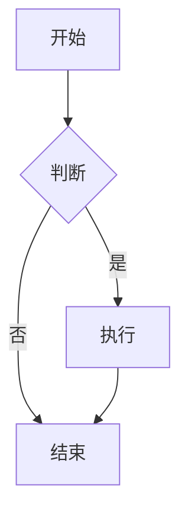

# Nota4 文件格式规范

**文档版本**: v1.1.1  
**创建日期**: 2025-11-19 08:26:02  
**最后更新**: 2025-11-19 08:26:02  
**目标读者**: 开发者、格式解析器开发者

---

## 📋 目录

- [1. 概述](#1-概述)
- [2. .nota 文件格式](#2-nota-文件格式)
- [3. 元数据规范](#3-元数据规范)
- [4. Markdown 内容规范](#4-markdown-内容规范)
- [5. 文件结构](#5-文件结构)
- [6. 解析规则](#6-解析规则)
- [7. 兼容性](#7-兼容性)

---

## 1. 概述

### 1.1 格式设计目标

- ✅ **可读性**: 纯文本格式，易于版本控制
- ✅ **可迁移**: 标准格式，易于导入其他工具
- ✅ **可扩展**: YAML 支持任意元数据
- ✅ **可解析**: 多种工具支持 YAML + Markdown

### 1.2 格式特点

- **扩展名**: `.nota`（专有格式，避免并发冲突）
- **元数据头**: YAML Front Matter（Jekyll、Hugo 通用格式）
- **正文**: 标准 Markdown
- **兼容性**: 可无损转换为纯 `.md`（移除元数据头）

---

## 2. .nota 文件格式

### 2.1 基本结构

```
---
YAML Front Matter (元数据)
---

Markdown Content (正文)
```

### 2.2 完整示例

```yaml
---
id: 550E8400-E29B-41D4-A716-446655440000
title: 示例笔记
created: 2025-11-16T09:00:00.000Z
updated: 2025-11-16T09:22:00.000Z
starred: false
pinned: false
deleted: false
tags:
  - 工作
  - Swift
checksum: d41d8cd98f00b204e9800998ecf8427e
---

# 笔记标题

这里是 Markdown 内容...

## 子标题

- 列表项 1
- 列表项 2

**加粗文本** 和 *斜体文本*

```swift
// 代码块
let hello = "world"
```
```

---

## 3. 元数据规范

### 3.1 必需字段

| 字段 | 类型 | 说明 | 示例 |
|------|------|------|------|
| `id` | String | UUID，唯一标识 | `550E8400-E29B-41D4-A716-446655440000` |
| `title` | String | 笔记标题 | `示例笔记` |
| `created` | String (ISO8601) | 创建时间 | `2025-11-16T09:00:00.000Z` |
| `updated` | String (ISO8601) | 更新时间 | `2025-11-16T09:22:00.000Z` |

### 3.2 可选字段

| 字段 | 类型 | 默认值 | 说明 |
|------|------|--------|------|
| `starred` | Boolean | `false` | 是否星标 |
| `pinned` | Boolean | `false` | 是否置顶 |
| `deleted` | Boolean | `false` | 是否删除 |
| `tags` | Array[String] | `[]` | 标签列表 |
| `checksum` | String | `null` | MD5 校验和 |

### 3.3 字段详细说明

#### id

- **类型**: String (UUID)
- **格式**: `XXXXXXXX-XXXX-XXXX-XXXX-XXXXXXXXXXXX`
- **用途**: 唯一标识笔记，用于文件名
- **生成**: 使用 `UUID().uuidString`
- **示例**: `550E8400-E29B-41D4-A716-446655440000`

#### title

- **类型**: String
- **用途**: 笔记标题
- **限制**: 无特殊限制，支持多行（不推荐）
- **示例**: `示例笔记`

#### created / updated

- **类型**: String (ISO8601 格式)
- **格式**: `YYYY-MM-DDTHH:mm:ss.SSSZ`
- **时区**: UTC (Z 后缀)
- **示例**: `2025-11-16T09:00:00.000Z`

#### starred / pinned / deleted

- **类型**: Boolean
- **值**: `true` 或 `false`
- **用途**: 笔记状态标记

#### tags

- **类型**: Array[String]
- **格式**: YAML 列表
- **唯一性**: 标签在数组中应唯一
- **示例**:
  ```yaml
  tags:
    - 工作
    - Swift
    - 重要
  ```

#### checksum

- **类型**: String (MD5 哈希)
- **格式**: 32 位十六进制字符串
- **用途**: 检测文件内容变化
- **计算**: 对 Markdown 内容计算 MD5
- **示例**: `d41d8cd98f00b204e9800998ecf8427e`

---

## 4. Markdown 内容规范

### 4.1 支持的 Markdown 语法

#### 基础语法

- **标题**: `# H1`, `## H2`, `### H3`, etc.
- **列表**: 有序列表、无序列表
- **引用**: `> 引用内容`
- **代码块**: 行内代码 `` `code` `` 和代码块 ` ```language `
- **链接**: `[文本](URL)`
- **图片**: ``
- **强调**: `**粗体**`, `*斜体*`

#### 扩展语法

- **表格**: GitHub Flavored Markdown 表格
- **任务列表**: `- [ ]` 和 `- [x]`
- **脚注**: `[^1]` 和 `[^1]: 脚注内容`
- **删除线**: `~~删除~~`
- **数学公式**: LaTeX 语法（通过 KaTeX 渲染）
- **Mermaid 图表**: 流程图、时序图等

### 4.2 代码块支持

```markdown
```swift
// Swift 代码
let hello = "world"
```

```python
# Python 代码
print("Hello, World!")
```

```javascript
// JavaScript 代码
console.log("Hello, World!");
```
```

### 4.3 数学公式支持

**行内公式**: `$E = mc^2$`

**块级公式**:
```markdown
$$
\int_{-\infty}^{\infty} e^{-x^2} dx = \sqrt{\pi}
$$
```

### 4.4 Mermaid 图表支持

```markdown

```

---

## 5. 文件结构

### 5.1 目录结构

```
NotaLibrary/
├── notes/
│   ├── 550E8400-E29B-41D4-A716-446655440000.nota
│   ├── 7F9E3B25-89A0-4D2E-B716-12C65DA37A18.nota
│   └── ...
├── trash/
│   └── 已删除笔记.nota
└── attachments/
    ├── 550E8400-E29B-41D4-A716-446655440000/
    │   ├── image1.png
    │   └── image2.jpg
    └── ...
```

### 5.2 文件命名规则

- **格式**: `{noteId}.nota`
- **noteId**: UUID 字符串（32 个十六进制字符，4 个连字符）
- **示例**: `550E8400-E29B-41D4-A716-446655440000.nota`

### 5.3 附件目录

- **路径**: `attachments/{noteId}/`
- **用途**: 存储笔记相关的图片和其他附件
- **命名**: 图片使用 UUID 作为文件名

---

## 6. 解析规则

### 6.1 YAML Front Matter 解析

1. **识别分隔符**: 文件必须以 `---` 开头
2. **提取 YAML**: 第一个 `---` 到第二个 `---` 之间的内容
3. **解析 YAML**: 使用 YAML 解析器（如 Yams）
4. **提取正文**: 第二个 `---` 之后的所有内容

### 6.2 解析示例 (Swift)

```swift
func parseNotaContent(_ content: String) throws -> Note {
    // 1. 检查是否有 YAML Front Matter
    guard content.hasPrefix("---") else {
        throw ParseError.invalidFormat
    }
    
    // 2. 分离 YAML 和 Markdown
    let components = content.components(separatedBy: "---")
    guard components.count >= 3 else {
        throw ParseError.invalidFormat
    }
    
    let yamlString = components[1]
    let markdownContent = components[2...]
        .joined(separator: "---")
        .trimmingCharacters(in: .whitespacesAndNewlines)
    
    // 3. 解析 YAML
    guard let yamlDict = try Yams.load(yaml: yamlString) as? [String: Any] else {
        throw ParseError.yamlParsingFailed
    }
    
    // 4. 提取字段
    let noteId = yamlDict["id"] as? String ?? UUID().uuidString
    let title = yamlDict["title"] as? String ?? ""
    let created = parseDate(yamlDict["created"] as? String) ?? Date()
    let updated = parseDate(yamlDict["updated"] as? String) ?? Date()
    let isStarred = yamlDict["starred"] as? Bool ?? false
    let isPinned = yamlDict["pinned"] as? Bool ?? false
    let isDeleted = yamlDict["deleted"] as? Bool ?? false
    let tags = yamlDict["tags"] as? [String] ?? []
    
    // 5. 创建 Note 对象
    return Note(
        noteId: noteId,
        title: title,
        content: markdownContent,
        created: created,
        updated: updated,
        isStarred: isStarred,
        isPinned: isPinned,
        isDeleted: isDeleted,
        tags: Set(tags)
    )
}
```

### 6.3 生成规则

```swift
func generateNotaContent(from note: Note) -> String {
    // 1. 构建 YAML Front Matter
    var yamlLines: [String] = ["---"]
    
    yamlLines.append("id: \(note.noteId)")
    yamlLines.append("title: \(note.title)")
    yamlLines.append("created: \(formatDate(note.created))")
    yamlLines.append("updated: \(formatDate(note.updated))")
    yamlLines.append("starred: \(note.isStarred)")
    yamlLines.append("pinned: \(note.isPinned)")
    yamlLines.append("deleted: \(note.isDeleted)")
    
    if !note.tags.isEmpty {
        yamlLines.append("tags:")
        for tag in note.tags.sorted() {
            yamlLines.append("  - \(tag)")
        }
    }
    
    if let checksum = note.checksum {
        yamlLines.append("checksum: \(checksum)")
    }
    
    yamlLines.append("---")
    
    // 2. 组合内容
    let yaml = yamlLines.joined(separator: "\n")
    return yaml + "\n\n" + note.content
}
```

---

## 7. 兼容性

### 7.1 与 Markdown 的兼容性

- ✅ **完全兼容**: 移除 YAML Front Matter 后，正文是标准 Markdown
- ✅ **导入支持**: 可以导入纯 `.md` 文件（自动生成元数据）
- ✅ **导出支持**: 可以导出为纯 `.md` 文件（可选是否包含元数据）

### 7.2 与其他工具的兼容性

#### Jekyll / Hugo

- ✅ **YAML Front Matter**: 使用相同的格式
- ✅ **兼容性**: 可以直接在 Jekyll/Hugo 中使用（需要移除 Nota4 特定字段）

#### Obsidian

- ✅ **Markdown**: 正文完全兼容
- ⚠️ **元数据**: Obsidian 使用不同的 Front Matter 格式，需要转换

#### Typora

- ✅ **Markdown**: 正文完全兼容
- ✅ **YAML**: 支持 YAML Front Matter

### 7.3 迁移指南

#### 从 Markdown 迁移到 .nota

1. 读取 `.md` 文件内容
2. 生成 UUID 作为 `id`
3. 从文件名提取 `title`
4. 使用当前时间作为 `created` 和 `updated`
5. 添加 YAML Front Matter
6. 保存为 `.nota` 文件

#### 从 .nota 迁移到 Markdown

1. 读取 `.nota` 文件
2. 移除 YAML Front Matter
3. 保留 Markdown 正文
4. 保存为 `.md` 文件

---

## 附录

### A. 日期格式

**ISO8601 格式**: `YYYY-MM-DDTHH:mm:ss.SSSZ`

**示例**:
- `2025-11-16T09:00:00.000Z`
- `2025-11-16T09:00:00Z` (无毫秒)

**解析**:
```swift
let formatter = ISO8601DateFormatter()
formatter.formatOptions = [.withInternetDateTime, .withFractionalSeconds]
let date = formatter.date(from: dateString)
```

### B. 校验和计算

```swift
import CryptoKit

func calculateChecksum(_ content: String) -> String {
    let data = content.data(using: .utf8)!
    let hash = Insecure.MD5.hash(data: data)
    return hash.map { String(format: "%02x", $0) }.joined()
}
```

### C. 参考资料

- [YAML 规范](https://yaml.org/spec/)
- [CommonMark 规范](https://commonmark.org/)
- [GitHub Flavored Markdown](https://github.github.com/gfm/)
- [ISO8601 日期格式](https://en.wikipedia.org/wiki/ISO_8601)

---

**文档维护者**: Nota4 开发团队  
**最后审核**: 2025-11-19  
**文档状态**: ✅ 活跃维护中

