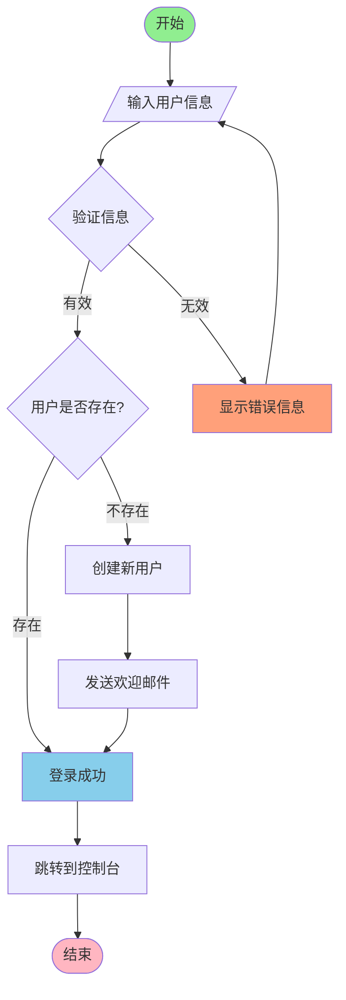
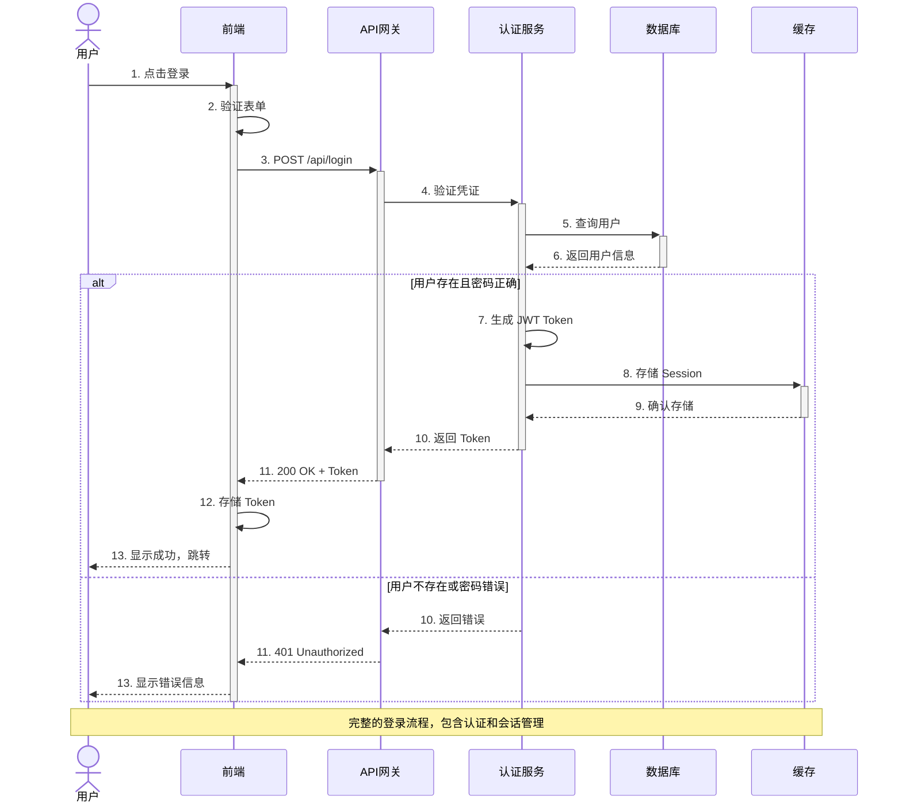
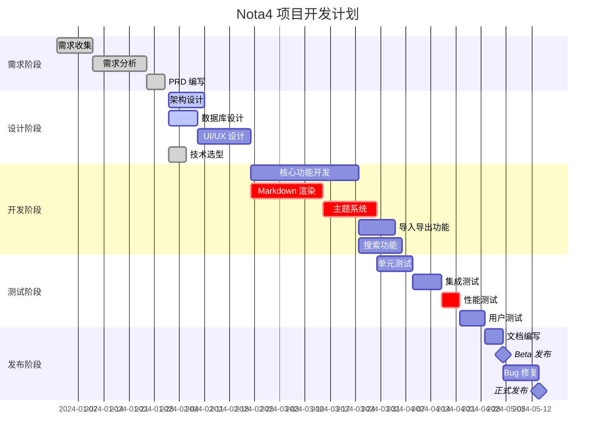
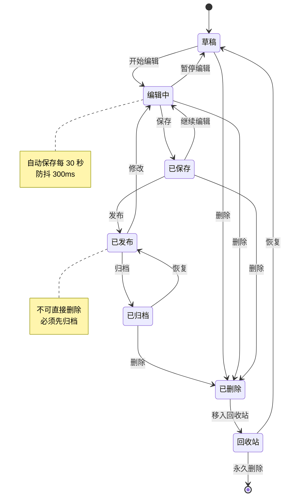
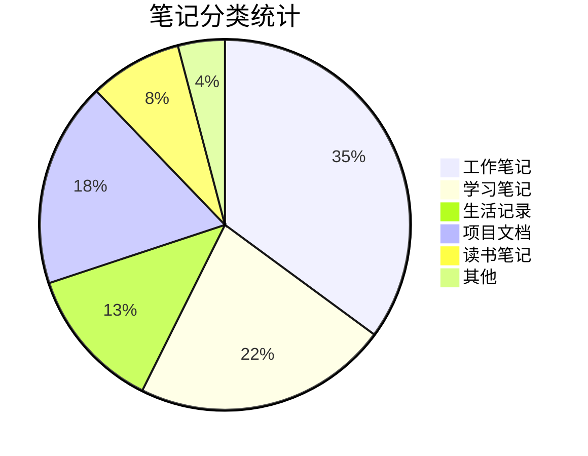
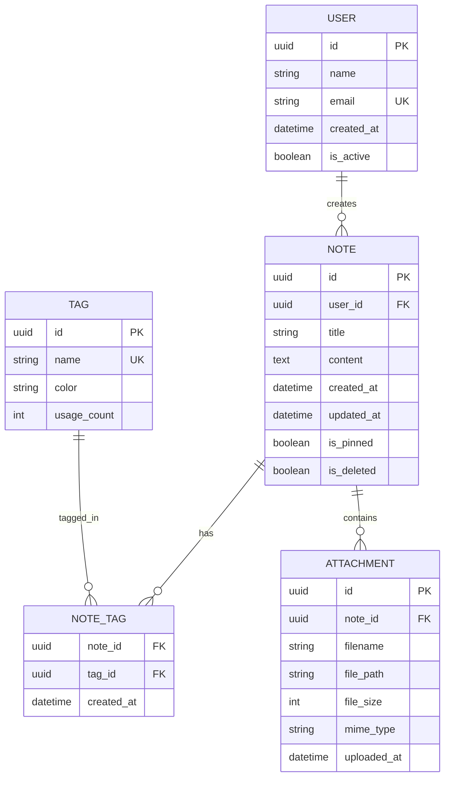
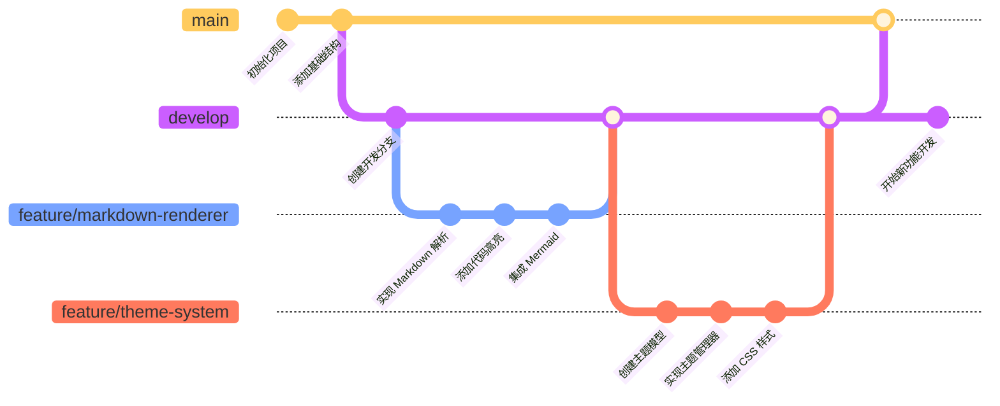
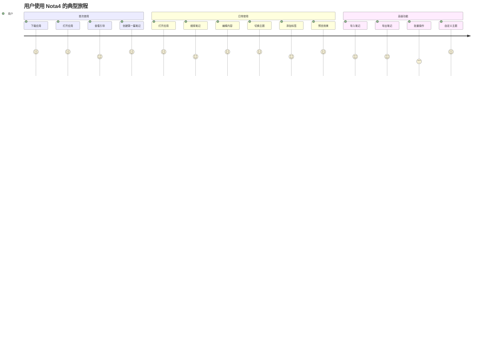
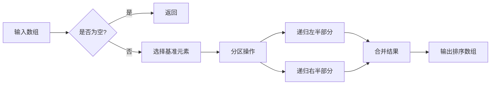

# 📋 Nota4 Markdown 渲染功能全面测试文档

**文档版本**: 1.0  
**创建日期**: 2025-11-16  
**用途**: 测试所有 Markdown 预览渲染功能

---

[TOC]

---

## 📚 测试内容概览

本文档将按以下顺序测试各项功能：

1. [基础 Markdown 语法](#1-基础-markdown-语法)
2. [代码语法高亮](#2-代码语法高亮)
3. [Mermaid 图表](#3-mermaid-图表集合)
4. [数学公式](#4-数学公式)
5. [表格和列表](#5-表格和列表)
6. [混合嵌套内容](#6-混合嵌套内容)
7. [特殊场景测试](#7-特殊场景测试)

---

## 1. 基础 Markdown 语法

### 1.1 标题层级展示

# H1 - 这是一级标题
## H2 - 这是二级标题
### H3 - 这是三级标题
#### H4 - 这是四级标题
##### H5 - 这是五级标题
###### H6 - 这是六级标题

### 1.2 文本样式

这是**粗体文本**，这是*斜体文本*，这是***粗斜体文本***。

这是~~删除线文本~~，这是`行内代码文本`。

这是普通文本，包含一个[超链接示例](https://www.example.com)。

### 1.3 引用块

> 这是一级引用
> 
> > 这是二级嵌套引用
> > 
> > > 这是三级嵌套引用
> 
> 回到一级引用

> 💡 **提示**: 引用块可以包含其他 Markdown 元素
> 
> - 列表项 1
> - 列表项 2
> 
> 甚至可以包含代码：`console.log('Hello')`

### 1.4 分隔线

使用三个或更多的 `-`、`*` 或 `_` 创建分隔线：

---

***

___

---

## 2. 代码语法高亮

### 2.1 Swift 代码

```swift
import Foundation
import SwiftUI
import ComposableArchitecture

// 定义用户模型
struct User: Codable, Identifiable, Equatable {
    let id: UUID
    var name: String
    var email: String
    var age: Int
    var isActive: Bool
    
    // 计算属性
    var displayName: String {
        return "👤 \(name) (\(age)岁)"
    }
    
    // 方法
    func greet() -> String {
        return isActive ? "你好，\(name)！" : "用户已停用"
    }
}

// Actor 示例
actor UserManager {
    private var users: [UUID: User] = [:]
    
    func addUser(_ user: User) {
        users[user.id] = user
        print("✅ 添加用户: \(user.name)")
    }
    
    func getUser(id: UUID) -> User? {
        return users[id]
    }
    
    func updateUser(_ user: User) async throws {
        guard users[user.id] != nil else {
            throw UserError.notFound
        }
        users[user.id] = user
    }
}

// 错误类型
enum UserError: LocalizedError {
    case notFound
    case invalidEmail
    case duplicateUser
    
    var errorDescription: String? {
        switch self {
        case .notFound: return "用户未找到"
        case .invalidEmail: return "无效的邮箱地址"
        case .duplicateUser: return "用户已存在"
        }
    }
}

// 使用示例
Task {
    let manager = UserManager()
    let user = User(
        id: UUID(),
        name: "张三",
        email: "zhangsan@example.com",
        age: 25,
        isActive: true
    )
    await manager.addUser(user)
    print(user.greet())
}
```

### 2.2 JavaScript / TypeScript 代码

```javascript
// ES6+ 特性示例
class TaskManager {
    constructor() {
        this.tasks = [];
        this.listeners = [];
    }
    
    // 添加任务
    addTask(title, priority = 'normal') {
        const task = {
            id: Date.now(),
            title,
            priority,
            completed: false,
            createdAt: new Date()
        };
        
        this.tasks.push(task);
        this.notifyListeners('taskAdded', task);
        return task;
    }
    
    // 完成任务
    completeTask(id) {
        const task = this.tasks.find(t => t.id === id);
        if (task) {
            task.completed = true;
            task.completedAt = new Date();
            this.notifyListeners('taskCompleted', task);
        }
    }
    
    // 获取未完成任务
    get incompleteTasks() {
        return this.tasks.filter(t => !t.completed);
    }
    
    // 观察者模式
    subscribe(listener) {
        this.listeners.push(listener);
        return () => {
            this.listeners = this.listeners.filter(l => l !== listener);
        };
    }
    
    notifyListeners(event, data) {
        this.listeners.forEach(listener => listener(event, data));
    }
}

// Promise 和 async/await
async function fetchUserData(userId) {
    try {
        const response = await fetch(`/api/users/${userId}`);
        if (!response.ok) {
            throw new Error(`HTTP error! status: ${response.status}`);
        }
        const data = await response.json();
        return data;
    } catch (error) {
        console.error('❌ 获取用户数据失败:', error);
        throw error;
    }
}

// 数组操作
const numbers = [1, 2, 3, 4, 5];
const doubled = numbers.map(n => n * 2);
const sum = numbers.reduce((acc, n) => acc + n, 0);
const evens = numbers.filter(n => n % 2 === 0);

console.log({ doubled, sum, evens });

// 解构和展开运算符
const user = { name: '李四', age: 30, city: '上海' };
const { name, ...rest } = user;
const updatedUser = { ...user, age: 31 };

// 箭头函数和高阶函数
const compose = (...fns) => x => fns.reduceRight((v, f) => f(v), x);
const add5 = x => x + 5;
const multiply2 = x => x * 2;
const result = compose(multiply2, add5)(10); // (10 + 5) * 2 = 30
```

### 2.3 Python 代码

```python
import asyncio
from typing import List, Dict, Optional, Callable
from dataclasses import dataclass
from datetime import datetime
import json

# 数据类
@dataclass
class Note:
    """笔记数据模型"""
    id: str
    title: str
    content: str
    tags: List[str]
    created_at: datetime
    updated_at: datetime
    is_pinned: bool = False
    
    def to_dict(self) -> Dict:
        """转换为字典"""
        return {
            'id': self.id,
            'title': self.title,
            'content': self.content,
            'tags': self.tags,
            'created_at': self.created_at.isoformat(),
            'updated_at': self.updated_at.isoformat(),
            'is_pinned': self.is_pinned
        }
    
    @classmethod
    def from_dict(cls, data: Dict) -> 'Note':
        """从字典创建"""
        return cls(
            id=data['id'],
            title=data['title'],
            content=data['content'],
            tags=data['tags'],
            created_at=datetime.fromisoformat(data['created_at']),
            updated_at=datetime.fromisoformat(data['updated_at']),
            is_pinned=data.get('is_pinned', False)
        )

# 装饰器
def timer(func: Callable) -> Callable:
    """性能计时装饰器"""
    async def wrapper(*args, **kwargs):
        start = asyncio.get_event_loop().time()
        result = await func(*args, **kwargs)
        end = asyncio.get_event_loop().time()
        print(f"⏱️ {func.__name__} 耗时: {end - start:.4f}秒")
        return result
    return wrapper

# 异步操作
class NoteRepository:
    """笔记仓库"""
    
    def __init__(self, db_path: str):
        self.db_path = db_path
        self.notes: Dict[str, Note] = {}
    
    @timer
    async def save_note(self, note: Note) -> None:
        """保存笔记"""
        await asyncio.sleep(0.1)  # 模拟 I/O
        self.notes[note.id] = note
        print(f"✅ 保存笔记: {note.title}")
    
    @timer
    async def find_by_tag(self, tag: str) -> List[Note]:
        """根据标签查找"""
        await asyncio.sleep(0.05)  # 模拟查询
        return [note for note in self.notes.values() if tag in note.tags]
    
    async def search(self, keyword: str) -> List[Note]:
        """全文搜索"""
        return [
            note for note in self.notes.values()
            if keyword.lower() in note.title.lower() 
            or keyword.lower() in note.content.lower()
        ]

# 列表推导式和生成器
def fibonacci(n: int) -> List[int]:
    """斐波那契数列"""
    return [x for x in _fib_generator(n)]

def _fib_generator(n: int):
    """斐波那契生成器"""
    a, b = 0, 1
    for _ in range(n):
        yield a
        a, b = b, a + b

# 上下文管理器
class DatabaseConnection:
    """数据库连接管理"""
    
    def __init__(self, connection_string: str):
        self.connection_string = connection_string
        self.connection = None
    
    def __enter__(self):
        print(f"📡 连接数据库: {self.connection_string}")
        self.connection = f"Connection<{self.connection_string}>"
        return self.connection
    
    def __exit__(self, exc_type, exc_val, exc_tb):
        print("🔌 关闭数据库连接")
        self.connection = None

# 使用示例
async def main():
    repo = NoteRepository("./notes.db")
    
    note = Note(
        id="note-001",
        title="Python 学习笔记",
        content="这是一篇关于 Python 的笔记",
        tags=["python", "编程", "学习"],
        created_at=datetime.now(),
        updated_at=datetime.now()
    )
    
    await repo.save_note(note)
    results = await repo.find_by_tag("python")
    print(f"📝 找到 {len(results)} 篇笔记")

if __name__ == "__main__":
    asyncio.run(main())
```

### 2.4 其他常用语言

#### Go

```go
package main

import (
    "fmt"
    "sync"
    "time"
)

// 结构体
type Task struct {
    ID       int
    Title    string
    Priority int
    Done     bool
}

// 接口
type TaskRepository interface {
    Add(task Task) error
    Get(id int) (*Task, error)
    List() []Task
}

// 并发示例
func processTasksConcurrently(tasks []Task) {
    var wg sync.WaitGroup
    resultChan := make(chan string, len(tasks))
    
    for _, task := range tasks {
        wg.Add(1)
        go func(t Task) {
            defer wg.Done()
            time.Sleep(100 * time.Millisecond)
            resultChan <- fmt.Sprintf("✅ 完成: %s", t.Title)
        }(task)
    }
    
    go func() {
        wg.Wait()
        close(resultChan)
    }()
    
    for result := range resultChan {
        fmt.Println(result)
    }
}
```

#### Rust

```rust
use std::collections::HashMap;

// 结构体和方法
struct Note {
    id: String,
    title: String,
    content: String,
    tags: Vec<String>,
}

impl Note {
    fn new(title: String, content: String) -> Self {
        Note {
            id: uuid::Uuid::new_v4().to_string(),
            title,
            content,
            tags: Vec::new(),
        }
    }
    
    fn add_tag(&mut self, tag: String) {
        if !self.tags.contains(&tag) {
            self.tags.push(tag);
        }
    }
}

// 泛型和 trait
trait Repository<T> {
    fn save(&mut self, item: T) -> Result<(), String>;
    fn find_by_id(&self, id: &str) -> Option<&T>;
}

// 枚举
enum TaskStatus {
    Pending,
    InProgress,
    Completed,
    Cancelled,
}
```

#### SQL

```sql
-- 创建表
CREATE TABLE notes (
    id UUID PRIMARY KEY DEFAULT gen_random_uuid(),
    title VARCHAR(255) NOT NULL,
    content TEXT,
    created_at TIMESTAMP DEFAULT CURRENT_TIMESTAMP,
    updated_at TIMESTAMP DEFAULT CURRENT_TIMESTAMP,
    is_deleted BOOLEAN DEFAULT FALSE
);

-- 创建索引
CREATE INDEX idx_notes_created_at ON notes(created_at DESC);
CREATE INDEX idx_notes_title ON notes USING gin(to_tsvector('english', title));

-- 复杂查询
SELECT 
    n.id,
    n.title,
    COUNT(t.id) as tag_count,
    MAX(n.updated_at) as last_updated
FROM notes n
LEFT JOIN note_tags nt ON n.id = nt.note_id
LEFT JOIN tags t ON nt.tag_id = t.id
WHERE n.is_deleted = FALSE
GROUP BY n.id, n.title
HAVING COUNT(t.id) > 0
ORDER BY last_updated DESC
LIMIT 10;

-- 窗口函数
SELECT 
    title,
    created_at,
    ROW_NUMBER() OVER (ORDER BY created_at DESC) as row_num,
    RANK() OVER (ORDER BY LENGTH(content) DESC) as content_rank
FROM notes;
```

---

## 3. Mermaid 图表集合

### 3.1 流程图 (Flowchart)



### 3.2 时序图 (Sequence Diagram)



### 3.3 甘特图 (Gantt Chart)



### 3.4 类图 (Class Diagram)

```mermaid
classDiagram
    %% 笔记应用的核心类图
    
    class Note {
        +UUID id
        +String title
        +String content
        +Date createdAt
        +Date updatedAt
        +Boolean isPinned
        +Boolean isDeleted
        +save()
        +delete()
        +restore()
        +pin()
        +unpin()
    }
    
    class Tag {
        +UUID id
        +String name
        +String color
        +Int noteCount
    }
    
    class NoteRepository {
        -Database db
        +createNote(Note) Note
        +updateNote(Note) Note
        +deleteNote(UUID) void
        +findById(UUID) Note?
        +findAll() List~Note~
        +search(String) List~Note~
    }
    
    class TagRepository {
        -Database db
        +createTag(Tag) Tag
        +findByNote(UUID) List~Tag~
        +findAll() List~Tag~
    }
    
    class NoteManager {
        -NoteRepository noteRepo
        -TagRepository tagRepo
        +createNoteWithTags(String, String, List~String~) Note
        +addTagToNote(UUID, UUID) void
        +removeTagFromNote(UUID, UUID) void
        +getNotesWithTag(String) List~Note~
    }
    
    class SearchService {
        -NoteRepository repo
        +searchByKeyword(String) List~Note~
        +searchByTag(String) List~Note~
        +searchByDateRange(Date, Date) List~Note~
        +indexNote(Note) void
    }
    
    class ExportService {
        +exportToMarkdown(Note) String
        +exportToPDF(Note) Data
        +exportToHTML(Note) String
        +batchExport(List~Note~, Format) Data
    }
    
    Note "1" --> "*" Tag : has
    NoteRepository --> Note : manages
    TagRepository --> Tag : manages
    NoteManager --> NoteRepository : uses
    NoteManager --> TagRepository : uses
    SearchService --> NoteRepository : uses
    ExportService --> Note : exports
    
    <<interface>> Repository
    Repository <|.. NoteRepository : implements
    Repository <|.. TagRepository : implements
```

### 3.5 状态图 (State Diagram)



### 3.6 饼图 (Pie Chart)



### 3.7 实体关系图 (ER Diagram)



### 3.8 Git 流程图



### 3.9 用户旅程图



---

## 4. 数学公式

### 4.1 基础公式

#### 行内公式

爱因斯坦质能方程: $E = mc^2$

勾股定理: $a^2 + b^2 = c^2$

圆的面积: $A = \pi r^2$

二次方程求根: $x = \frac{-b \pm \sqrt{b^2-4ac}}{2a}$

### 4.2 块公式

#### 微积分

高斯积分：

$$
\int_{-\infty}^{\infty} e^{-x^2} dx = \sqrt{\pi}
$$

导数定义：

$$
\frac{df}{dx} = \lim_{h \to 0} \frac{f(x+h) - f(x)}{h}
$$

定积分基本定理：

$$
\int_a^b f(x)dx = F(b) - F(a)
$$

#### 级数展开

泰勒级数：

$$
f(x) = \sum_{n=0}^{\infty} \frac{f^{(n)}(a)}{n!}(x-a)^n
$$

指数函数展开：

$$
e^x = \sum_{n=0}^{\infty} \frac{x^n}{n!} = 1 + x + \frac{x^2}{2!} + \frac{x^3}{3!} + \cdots
$$

正弦函数展开：

$$
\sin(x) = \sum_{n=0}^{\infty} \frac{(-1)^n}{(2n+1)!}x^{2n+1} = x - \frac{x^3}{3!} + \frac{x^5}{5!} - \cdots
$$

### 4.3 线性代数

#### 矩阵运算

矩阵乘法：

$$
\begin{bmatrix}
a_{11} & a_{12} & a_{13} \\
a_{21} & a_{22} & a_{23} \\
a_{31} & a_{32} & a_{33}
\end{bmatrix}
\times
\begin{bmatrix}
x_1 \\
x_2 \\
x_3
\end{bmatrix}
=
\begin{bmatrix}
a_{11}x_1 + a_{12}x_2 + a_{13}x_3 \\
a_{21}x_1 + a_{22}x_2 + a_{23}x_3 \\
a_{31}x_1 + a_{32}x_2 + a_{33}x_3
\end{bmatrix}
$$

行列式：

$$
\det(A) = \begin{vmatrix}
a & b & c \\
d & e & f \\
g & h & i
\end{vmatrix}
= a(ei-fh) - b(di-fg) + c(dh-eg)
$$

特征值方程：

$$
\det(A - \lambda I) = 0
$$

### 4.4 概率统计

#### 概率分布

正态分布概率密度函数：

$$
f(x) = \frac{1}{\sigma\sqrt{2\pi}} e^{-\frac{(x-\mu)^2}{2\sigma^2}}
$$

二项分布：

$$
P(X = k) = \binom{n}{k} p^k (1-p)^{n-k} = \frac{n!}{k!(n-k)!} p^k (1-p)^{n-k}
$$

泊松分布：

$$
P(X = k) = \frac{\lambda^k e^{-\lambda}}{k!}
$$

#### 期望和方差

期望：

$$
E[X] = \sum_{i=1}^{n} x_i p(x_i) = \int_{-\infty}^{\infty} x f(x) dx
$$

方差：

$$
\text{Var}(X) = E[(X - E[X])^2] = E[X^2] - (E[X])^2
$$

标准差：

$$
\sigma = \sqrt{\text{Var}(X)}
$$

### 4.5 复杂方程组

线性方程组：

$$
\begin{cases}
a_1x + b_1y + c_1z = d_1 \\
a_2x + b_2y + c_2z = d_2 \\
a_3x + b_3y + c_3z = d_3
\end{cases}
$$

微分方程：

$$
\frac{\partial^2 u}{\partial t^2} = c^2 \nabla^2 u = c^2 \left( \frac{\partial^2 u}{\partial x^2} + \frac{\partial^2 u}{\partial y^2} + \frac{\partial^2 u}{\partial z^2} \right)
$$

麦克斯韦方程组：

$$
\begin{align}
\nabla \cdot \mathbf{E} &= \frac{\rho}{\epsilon_0} \\
\nabla \cdot \mathbf{B} &= 0 \\
\nabla \times \mathbf{E} &= -\frac{\partial \mathbf{B}}{\partial t} \\
\nabla \times \mathbf{B} &= \mu_0\mathbf{J} + \mu_0\epsilon_0\frac{\partial \mathbf{E}}{\partial t}
\end{align}
$$

### 4.6 机器学习公式

梯度下降：

$$
\theta_{t+1} = \theta_t - \alpha \nabla J(\theta_t)
$$

Softmax 函数：

$$
\text{softmax}(x_i) = \frac{e^{x_i}}{\sum_{j=1}^{n} e^{x_j}}
$$

交叉熵损失：

$$
L = -\sum_{i=1}^{n} y_i \log(\hat{y}_i)
$$

---

## 5. 表格和列表

### 5.1 复杂表格

#### 功能对比表

| 功能 | Nota4 | Typora | Obsidian | Bear | 说明 |
|:-----|:-----:|:------:|:--------:|:----:|:-----|
| Markdown 支持 | ✅ | ✅ | ✅ | ✅ | 基础支持 |
| 代码高亮 | ✅ | ✅ | ✅ | ⚠️ | Nota4 使用 Splash |
| Mermaid 图表 | ✅ | ✅ | ✅ | ❌ | 完整支持 |
| 数学公式 | ✅ | ✅ | ✅ | ❌ | 使用 KaTeX |
| 主题系统 | ✅ | ✅ | ✅ | ⚠️ | 可自定义 |
| 实时预览 | ✅ | ✅ | ⚠️ | ✅ | 分屏模式 |
| 云同步 | 🚧 | ❌ | ✅ | ✅ | 计划中 |
| 价格 | 免费 | $14.99 | 免费/$10 | 免费/$1.49/月 | - |

图例: ✅ 支持 | ⚠️ 部分支持 | ❌ 不支持 | 🚧 开发中

#### 数据统计表

| 日期 | 新增笔记 | 编辑次数 | 字数统计 | 代码行数 | 使用时长(分钟) |
|------|----------|----------|----------|----------|----------------|
| 2024-01-15 | 5 | 23 | 4,532 | 487 | 125 |
| 2024-01-16 | 8 | 31 | 6,789 | 623 | 156 |
| 2024-01-17 | 3 | 15 | 2,341 | 201 | 78 |
| 2024-01-18 | 12 | 45 | 9,876 | 1,024 | 201 |
| 2024-01-19 | 6 | 28 | 5,432 | 567 | 142 |
| **总计** | **34** | **142** | **28,970** | **2,902** | **702** |

### 5.2 多级列表

#### 任务列表

- [x] **Phase 1: 基础架构**
  - [x] 项目初始化
  - [x] 依赖配置
  - [x] 基础组件
    - [x] NoteList 组件
    - [x] Editor 组件
    - [x] Preview 组件
  - [x] TCA 架构搭建

- [x] **Phase 2: 核心功能**
  - [x] Markdown 渲染
    - [x] 集成 Ink 解析器
    - [x] 代码语法高亮（Splash）
    - [x] Mermaid 图表支持
    - [x] 数学公式支持（KaTeX）
  - [x] 主题系统
    - [x] ThemeManager 实现
    - [x] 4个内置主题
    - [x] 自定义主题导入/导出
  - [x] 图片处理
    - [x] 本地图片支持
    - [x] 外部链接支持
    - [x] 图片缓存机制

- [ ] **Phase 3: 高级功能**
  - [x] TOC 目录生成
  - [ ] 全文搜索
    - [ ] 标题搜索
    - [ ] 内容搜索
    - [ ] 标签搜索
  - [ ] 导入导出
    - [ ] Markdown 导出
    - [ ] PDF 导出
    - [ ] HTML 导出
  - [ ] 云同步
    - [ ] iCloud 同步
    - [ ] 冲突解决

#### 功能清单

1. **编辑器功能**
   1. 实时预览
   2. 分屏模式
   3. 纯编辑模式
   4. 纯预览模式
   5. 自动保存
      - 防抖 300ms
      - 本地存储
      - 版本历史

2. **渲染功能**
   1. 代码高亮
      - Swift
      - JavaScript/TypeScript
      - Python
      - Go
      - Rust
      - SQL
      - 其他 50+ 语言
   2. 图表渲染
      - Mermaid 流程图
      - 时序图
      - 甘特图
      - 类图
      - 状态图
      - 饼图
      - ER 图
   3. 数学公式
      - 行内公式
      - 块公式
      - 矩阵
      - 方程组

3. **组织功能**
   1. 标签系统
   2. 文件夹
   3. 收藏夹
   4. 最近使用
   5. 回收站

---

## 6. 混合嵌套内容

### 6.1 引用中的代码

> 📌 **最佳实践**: 使用 Actor 来管理共享状态
> 
> ```swift
> actor Counter {
>     private var value = 0
>     
>     func increment() {
>         value += 1
>     }
>     
>     func getValue() -> Int {
>         return value
>     }
> }
> ```
> 
> Actor 确保了状态访问的线程安全。

### 6.2 列表中的公式

算法复杂度分析：

1. **线性查找**: $O(n)$
   - 遍历数组的每个元素
   - 最坏情况：$n$ 次比较

2. **二分查找**: $O(\log n)$
   - 每次将搜索范围减半
   - 递归公式：$T(n) = T(n/2) + O(1)$

3. **快速排序**: $O(n \log n)$ 平均
   - 分治算法
   - 递归关系：$T(n) = 2T(n/2) + O(n)$
   - 最坏情况：$O(n^2)$

4. **归并排序**: $O(n \log n)$ 稳定
   - 时间复杂度：$T(n) = 2T(n/2) + \Theta(n)$
   - 空间复杂度：$O(n)$

### 6.3 表格中的公式

| 算法 | 时间复杂度 | 空间复杂度 | 稳定性 |
|------|-----------|-----------|--------|
| 冒泡排序 | $O(n^2)$ | $O(1)$ | ✅ |
| 选择排序 | $O(n^2)$ | $O(1)$ | ❌ |
| 插入排序 | $O(n^2)$ | $O(1)$ | ✅ |
| 快速排序 | $O(n \log n)$ | $O(\log n)$ | ❌ |
| 归并排序 | $O(n \log n)$ | $O(n)$ | ✅ |
| 堆排序 | $O(n \log n)$ | $O(1)$ | ❌ |

### 6.4 图表配合代码

#### 算法实现流程



#### 对应代码实现

```swift
func quickSort<T: Comparable>(_ array: [T]) -> [T] {
    // 基础情况
    guard array.count > 1 else {
        return array
    }
    
    // 选择基准元素
    let pivot = array[array.count / 2]
    
    // 分区
    let less = array.filter { $0 < pivot }
    let equal = array.filter { $0 == pivot }
    let greater = array.filter { $0 > pivot }
    
    // 递归 + 合并
    return quickSort(less) + equal + quickSort(greater)
}

// 使用示例
let numbers = [64, 34, 25, 12, 22, 11, 90]
let sorted = quickSort(numbers)
print("排序结果: \(sorted)")
// 输出: [11, 12, 22, 25, 34, 64, 90]
```

---

## 7. 特殊场景测试

### 7.1 特殊字符

#### HTML 实体

&copy; 版权符号  
&reg; 注册商标  
&trade; 商标  
&lt; 小于号  
&gt; 大于号  
&amp; 与符号  
&nbsp; 不换行空格

#### Emoji 表情

**表情分类**:

😀 😃 😄 😁 😆 😅 🤣 😂 😊 😇 🙂 🙃 😉 😌  
❤️ 💕 💖 💗 💙 💚 💛 🧡 💜 🖤 🤍 🤎 💔 ❣️  
👍 👎 👏 🙌 🤝 💪 🦾 🙏 ✍️ 🤳  
🎉 🎊 🎈 🎁 🏆 🥇 🥈 🥉  
⭐ ✨ 🌟 💫 ⚡ 🔥 💧 ☀️ 🌈  
📝 📚 📖 📄 📃 📋 📌 📍 ✅ ❌

### 7.2 超长内容测试

#### 长代码块

```python
# 这是一个超长的 Python 代码示例，用于测试代码块的渲染性能
class ComplexDataProcessor:
    """复杂数据处理器 - 用于测试长代码渲染"""
    
    def __init__(self, config):
        self.config = config
        self.data = []
        self.results = {}
        self.cache = {}
        self.metrics = {
            'processed': 0,
            'failed': 0,
            'cached': 0,
            'average_time': 0.0
        }
    
    async def process_data_pipeline(self, input_data):
        """数据处理管道"""
        try:
            # 步骤 1: 数据验证
            validated_data = await self.validate_input(input_data)
            
            # 步骤 2: 数据清洗
            cleaned_data = await self.clean_data(validated_data)
            
            # 步骤 3: 数据转换
            transformed_data = await self.transform_data(cleaned_data)
            
            # 步骤 4: 数据分析
            analyzed_data = await self.analyze_data(transformed_data)
            
            # 步骤 5: 结果输出
            results = await self.generate_output(analyzed_data)
            
            self.metrics['processed'] += 1
            return results
            
        except Exception as e:
            self.metrics['failed'] += 1
            print(f"处理失败: {str(e)}")
            raise
    
    async def validate_input(self, data):
        """验证输入数据"""
        if not data:
            raise ValueError("输入数据为空")
        
        required_fields = ['id', 'timestamp', 'value']
        for field in required_fields:
            if field not in data:
                raise ValueError(f"缺少必需字段: {field}")
        
        return data
    
    async def clean_data(self, data):
        """清洗数据"""
        cleaned = {}
        
        # 移除空值
        for key, value in data.items():
            if value is not None and value != '':
                cleaned[key] = value
        
        # 标准化格式
        if 'timestamp' in cleaned:
            cleaned['timestamp'] = self.normalize_timestamp(cleaned['timestamp'])
        
        return cleaned
    
    async def transform_data(self, data):
        """转换数据格式"""
        transformed = data.copy()
        
        # 应用转换规则
        for rule in self.config.get('transform_rules', []):
            transformed = self.apply_rule(transformed, rule)
        
        return transformed
    
    async def analyze_data(self, data):
        """分析数据"""
        analysis = {
            'raw_data': data,
            'statistics': self.calculate_statistics(data),
            'patterns': self.detect_patterns(data),
            'anomalies': self.detect_anomalies(data)
        }
        
        return analysis
    
    async def generate_output(self, analyzed_data):
        """生成输出结果"""
        output = {
            'success': True,
            'data': analyzed_data,
            'metadata': {
                'processed_at': datetime.now().isoformat(),
                'version': '1.0.0',
                'metrics': self.metrics
            }
        }
        
        return output
```

### 7.3 深层嵌套

> #### 一级引用
> 
> 这是第一层引用的内容
> 
> > ##### 二级引用
> > 
> > 这是第二层引用
> > 
> > 1. 列表项 1
> >    - 子项 1.1
> >      - 子子项 1.1.1
> >        ```python
> >        def nested_function():
> >            return "deeply nested"
> >        ```
> > 
> > > ###### 三级引用
> > > 
> > > 包含公式: $f(x) = x^2 + 2x + 1$
> > > 
> > > 和表格:
> > > 
> > > | A | B |
> > > |---|---|
> > > | 1 | 2 |

---

## 8. 性能测试内容

### 8.1 重复段落（测试渲染性能）

Lorem ipsum dolor sit amet, consectetur adipiscing elit. Sed do eiusmod tempor incididunt ut labore et dolore magna aliqua. Ut enim ad minim veniam, quis nostrud exercitation ullamco laboris nisi ut aliquip ex ea commodo consequat. Duis aute irure dolor in reprehenderit in voluptate velit esse cillum dolore eu fugiat nulla pariatur.

Lorem ipsum dolor sit amet, consectetur adipiscing elit. Integer nec odio. Praesent libero. Sed cursus ante dapibus diam. Sed nisi. Nulla quis sem at nibh elementum imperdiet. Duis sagittis ipsum. Praesent mauris. Fusce nec tellus sed augue semper porta.

Lorem ipsum dolor sit amet, consectetur adipiscing elit. Mauris ipsum. Nulla metus metus, ullamcorper vel, tincidunt sed, euismod in, nibh. Quisque volutpat condimentum velit. Class aptent taciti sociosqu ad litora torquent per conubia nostra, per inceptos himenaeos.

---

## ✅ 测试检查清单

使用本文档测试时，请验证以下项目：

### 基础渲染
- [ ] 所有标题层级正确显示
- [ ] 文本样式（粗体、斜体、删除线）正确
- [ ] 链接可点击
- [ ] 引用块样式正确
- [ ] 列表缩进正确

### 代码高亮
- [ ] Swift 代码高亮正确
- [ ] JavaScript 代码高亮正确
- [ ] Python 代码高亮正确
- [ ] 其他语言代码高亮正确
- [ ] 代码块有语言标签

### Mermaid 图表
- [ ] 流程图渲染正确
- [ ] 时序图渲染正确
- [ ] 甘特图渲染正确
- [ ] 类图渲染正确
- [ ] 状态图渲染正确
- [ ] 饼图渲染正确
- [ ] ER 图渲染正确
- [ ] Git 图渲染正确

### 数学公式
- [ ] 行内公式显示正确
- [ ] 块公式居中显示
- [ ] 矩阵渲染正确
- [ ] 复杂方程组渲染正确
- [ ] 特殊符号显示正确

### 表格
- [ ] 基础表格显示正确
- [ ] 表格对齐正确
- [ ] 表格中的公式显示正确

### 主题切换
- [ ] 切换到浅色主题
- [ ] 切换到深色主题
- [ ] 切换到 GitHub 主题
- [ ] 切换到 Notion 主题
- [ ] 代码高亮适配主题
- [ ] Mermaid 图表适配主题

### 性能
- [ ] 文档加载流畅（< 2s）
- [ ] 滚动流畅无卡顿
- [ ] 编辑时预览实时更新（300ms 防抖）
- [ ] 内存占用正常（< 200MB）

---

## 📝 测试结论

**测试日期**: _____________

**测试人员**: _____________

**通过项目**: _____ / 42

**发现问题**: 

1. 
2. 
3. 

**综合评价**: 

---

**文档结束** ✨

如果所有功能都正常显示，那么 Markdown 预览渲染增强功能就已经完美实现了！🎉

