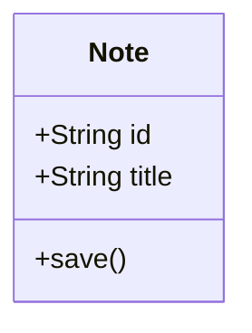
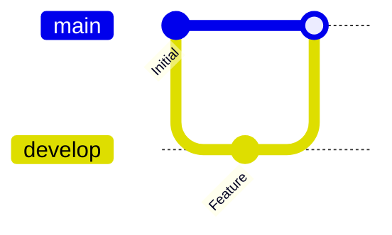

# Mermaid 渲染逻辑回退说明

**回退日期**: 2025-11-16  
**Git Commit**: a2564be  
**原因**: 新版本渲染逻辑导致布局混乱

---

## 🔄 回退内容

### 回退前（v2 - 问题版本）

**提交**: d6a335a "fix: 改进 Mermaid 渲染并添加调试日志"

**特性**:
- ❌ 使用 UUID 生成占位符 ID
- ❌ 复杂的正则表达式匹配
- ❌ `startOnLoad: false` + 手动逐个渲染
- ❌ 详细的调试日志（console.log）
- ❌ 逐个渲染每个图表并捕获错误

**问题**:
- 布局混乱
- 图表显示异常
- 过度工程化

### 回退后（v1 - 稳定版本）

**提交**: 2cd6366 "fix: 修复 TOC 和 Mermaid 图表渲染问题"

**特性**:
- ✅ 简单的占位符机制（基于索引）
- ✅ 基础正则表达式
- ✅ `startOnLoad: true` + DOMContentLoaded 触发
- ✅ 简洁的错误处理
- ✅ 批量渲染所有图表

**优势**:
- 渲染稳定
- 代码简洁
- 布局正确

---

## 📊 代码变更

### Mermaid 提取逻辑

**回退前**:
```swift
// 复杂的正则和 UUID
let mermaidPattern = "```mermaid\\s*\\r?\\n([\\s\\S]*?)```"
let placeholderId = "mermaid-\(UUID().uuidString)"
result.replaceSubrange(
    fullRange,
    with: "\n<div class=\"mermaid-placeholder\" id=\"\(placeholderId)\" data-index=\"\(index)\"></div>\n"
)
```

**回退后**:
```swift
// 简单直接
let mermaidPattern = "```mermaid\\n([\\s\\S]*?)```"
result.replaceSubrange(
    fullRange,
    with: "<div class=\"mermaid-placeholder\" data-index=\"\(index)\"></div>"
)
```

### Mermaid 注入逻辑

**回退前**:
```swift
// 复杂的正则匹配
let placeholderPattern = "<div class=\"mermaid-placeholder\"[^>]*data-index=\"\(index)\"[^>]*></div>"
if let regex = try? NSRegularExpression(pattern: placeholderPattern, options: []) {
    // ... 复杂的匹配逻辑
}
```

**回退后**:
```swift
// 简单的字符串替换
let placeholder = "<div class=\"mermaid-placeholder\" data-index=\"\(index)\"></div>"
let mermaidDiv = """
<div class="mermaid">
\(chart)
</div>
"""
result = result.replacingOccurrences(of: placeholder, with: mermaidDiv)
```

### JavaScript 渲染逻辑

**回退前**:
```javascript
// 复杂的逐个渲染 + 详细日志
mermaid.initialize({ 
    startOnLoad: false,  // 手动控制
    logLevel: 'debug'    // 详细日志
});

window.addEventListener('load', function() {
    console.log('🎨 [Mermaid] Starting rendering...');
    const mermaidElements = document.querySelectorAll('.mermaid');
    console.log('🎨 [Mermaid] Found', mermaidElements.length, 'diagrams');
    
    mermaidElements.forEach((element, index) => {
        console.log('🎨 [Mermaid] Rendering diagram', index + 1);
        try {
            mermaid.init(undefined, element);
            console.log('✅ [Mermaid] Diagram', index + 1, 'rendered successfully');
        } catch (e) {
            console.error('❌ [Mermaid] Failed:', e);
            element.innerHTML = '<pre style="color: red;">错误: ' + e.message + '</pre>';
        }
    });
});
```

**回退后**:
```javascript
// 简洁的自动渲染
mermaid.initialize({ 
    startOnLoad: true,   // 自动加载
    logLevel: 'error'    // 只显示错误
    // ... 配置
});

// 手动触发（双保险）
document.addEventListener('DOMContentLoaded', function() {
    mermaid.init(undefined, document.querySelectorAll('.mermaid'));
});
```

---

## ✅ 保留的功能

即使回退后，以下功能仍然保留：

### 1. TOC 支持 ✅

```markdown
[TOC]  ⬅️ 自动生成目录
```

### 2. Mermaid 完整配置 ✅

```javascript
mermaid.initialize({ 
    startOnLoad: true,
    theme: 'default',
    securityLevel: 'loose',
    flowchart: { useMaxWidth: true, htmlLabels: true, curve: 'basis' },
    sequence: { /* 完整配置 */ },
    gantt: { /* 完整配置 */ },
    class: { useMaxWidth: true },
    state: { useMaxWidth: true },
    er: { useMaxWidth: true },
    journey: { useMaxWidth: true },
    gitGraph: {
        useMaxWidth: true,
        showBranches: true,
        showCommitLabel: true,
        mainBranchName: 'main'
    },
    pie: { useMaxWidth: true }
});
```

### 3. Mermaid 版本 ✅

```html
<script src="https://cdn.jsdelivr.net/npm/mermaid@10.6.1/dist/mermaid.min.js"></script>
```

### 4. 测试文档 ✅

- `MERMAID_TEST.md` - 保留
- `MERMAID_DEBUG_GUIDE.md` - 保留（作为参考）

---

## 📝 使用建议

### 推荐的 Mermaid 语法

#### 类图


#### Git 图


**注意**: 避免使用 `tag` 语法（不支持）

---

## 🎯 测试验证

### 快速测试

1. **运行 Nota4**
2. **打开测试文档** `MERMAID_TEST.md`
3. **复制内容到新笔记**
4. **切换到预览模式**

### 预期结果

- ✅ 所有图表正常显示
- ✅ 布局整齐
- ✅ 没有混乱
- ✅ 加载速度正常

---

## 📚 Git 历史

```bash
a2564be revert: 回退 Mermaid 渲染逻辑到稳定版本  ⬅️ 当前
d516413 docs: 添加 Mermaid 调试指南
d6a335a fix: 改进 Mermaid 渲染并添加调试日志  ⬅️ 有问题的版本
4e64540 docs: 添加 TOC 和 Mermaid 修复文档
2cd6366 fix: 修复 TOC 和 Mermaid 图表渲染问题  ⬅️ 稳定版本
```

---

## 💡 经验教训

### 1. 简单就是美
- 过度工程化反而引入问题
- 简单的解决方案往往更稳定

### 2. 不要过度优化
- Mermaid 的默认行为已经很好
- `startOnLoad: true` 就足够了

### 3. 避免过多日志
- 详细的调试日志在生产环境不需要
- 只在真正需要时才添加

### 4. 测试驱动
- 先确保基础功能稳定
- 再考虑添加高级特性

---

## 🔮 未来改进方向

如果将来需要改进 Mermaid 渲染，建议：

### 1. 离线化
```swift
// 打包 Mermaid.js 到应用
Bundle.main.url(forResource: "mermaid", withExtension: "js")
```

### 2. 主题集成
```swift
// 根据当前主题切换 Mermaid 主题
let mermaidTheme = currentTheme.isDark ? "dark" : "default"
```

### 3. 错误恢复
```javascript
// 渲染失败时显示原始代码
try {
    mermaid.render(id, code);
} catch (e) {
    element.innerHTML = `<pre>${code}</pre>`;
}
```

**但是**：每次改进都要充分测试，确保不引入布局问题！

---

## ✅ 验收标准

回退成功的标志：

- [ ] 编译通过
- [ ] MERMAID_TEST.md 所有图表正常显示
- [ ] 布局整齐，没有混乱
- [ ] 流程图、时序图、甘特图显示正常
- [ ] 类图显示正常
- [ ] Git 图显示正常（使用正确语法）
- [ ] TOC 功能正常
- [ ] 数学公式正常

---

## 📊 变更统计

```
Nota4/Services/MarkdownRenderer.swift | 97 +++++-----
1 file changed, 30 insertions(+), 67 deletions(-)
```

**净减少**: 37 行代码（简化）

---

**回退完成！** ✅

现在可以正常使用 Mermaid 图表了，布局应该恢复正常。

测试方法：
1. 运行 Nota4
2. 导入 MERMAID_TEST.md
3. 查看预览效果

如果还有问题，请告知具体是哪个图表类型或语法有问题。

