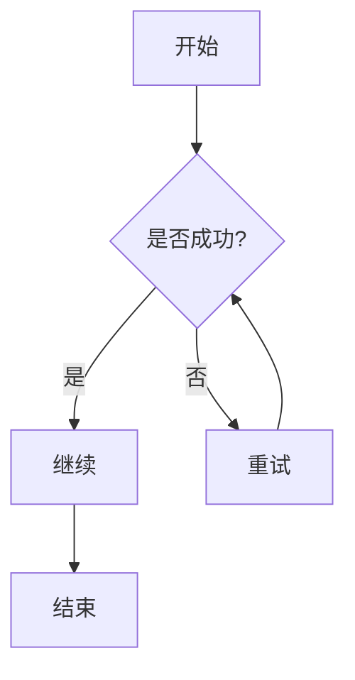
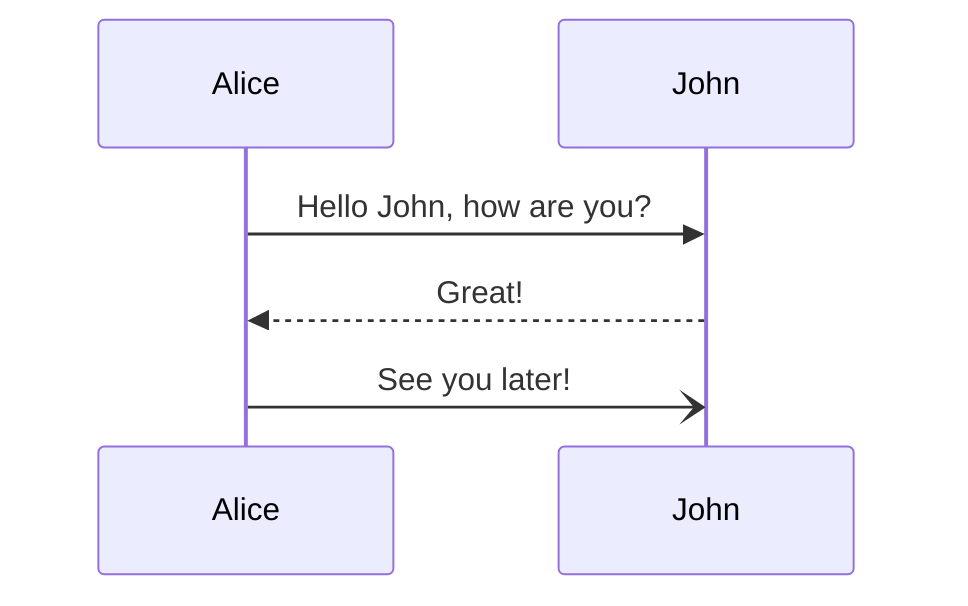
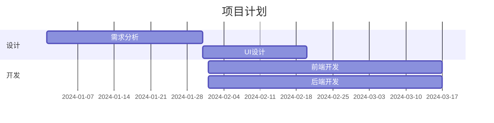

# Markdown 预览渲染增强 - 测试用例

**日期**: 2025-11-16  
**版本**: v1.0  
**状态**: 待测试

---

## 📋 测试概览

本文档提供了 Markdown 预览渲染增强功能的完整测试用例，用于手动验证所有功能是否正常工作。

---

## 🧪 测试环境

- **macOS 版本**: 14.0+
- **Xcode 版本**: 15.0+
- **Swift 版本**: 5.9+
- **测试方式**: 手动功能测试

---

## ✅ 测试用例列表

### 1. 基础 Markdown 渲染

#### 测试 1.1: 标题层级
```markdown
# 一级标题
## 二级标题
### 三级标题
#### 四级标题
##### 五级标题
###### 六级标题
```

**预期结果**:
- ✅ 所有标题正确显示
- ✅ 标题大小递减
- ✅ H1、H2 有下划线

---

#### 测试 1.2: 文本样式
```markdown
这是**粗体**文本。
这是*斜体*文本。
这是~~删除线~~文本。
这是`行内代码`文本。
```

**预期结果**:
- ✅ 粗体、斜体、删除线正确显示
- ✅ 行内代码有背景色

---

#### 测试 1.3: 列表
```markdown
无序列表：
- 项目 1
- 项目 2
  - 子项目 2.1
  - 子项目 2.2

有序列表：
1. 第一项
2. 第二项
3. 第三项
```

**预期结果**:
- ✅ 列表正确缩进
- ✅ 嵌套列表正确显示

---

#### 测试 1.4: 链接和引用
```markdown
这是一个[链接](https://example.com)。

> 这是一段引用文本。
> 可以有多行。
```

**预期结果**:
- ✅ 链接可点击（在外部浏览器打开）
- ✅ 引用块有左侧边框

---

### 2. 代码高亮测试

#### 测试 2.1: Swift 代码高亮
````markdown
```swift
import Foundation

struct User: Codable {
    let name: String
    let age: Int
    
    func greet() -> String {
        return "Hello, \(name)!"
    }
}
```
````

**预期结果**:
- ✅ 关键字高亮（import、struct、func、return）
- ✅ 字符串高亮
- ✅ 右上角显示语言标签 "SWIFT"

---

#### 测试 2.2: JavaScript 代码高亮
````markdown
```javascript
function fibonacci(n) {
    if (n <= 1) return n;
    return fibonacci(n - 1) + fibonacci(n - 2);
}

console.log(fibonacci(10));
```
````

**预期结果**:
- ✅ 关键字高亮（function、if、return）
- ✅ 注释高亮
- ✅ 右上角显示 "JAVASCRIPT"

---

#### 测试 2.3: Python 代码高亮
````markdown
```python
def quicksort(arr):
    if len(arr) <= 1:
        return arr
    pivot = arr[len(arr) // 2]
    left = [x for x in arr if x < pivot]
    middle = [x for x in arr if x == pivot]
    right = [x for x in arr if x > pivot]
    return quicksort(left) + middle + quicksort(right)
```
````

**预期结果**:
- ✅ def、if、return、for、in 高亮
- ✅ 列表推导式正确高亮

---

### 3. Mermaid 图表测试

#### 测试 3.1: 流程图
````markdown

````

**预期结果**:
- ✅ 流程图正确渲染
- ✅ 中文文本正确显示
- ✅ 箭头和连接线清晰

---

#### 测试 3.2: 时序图
````markdown

````

**预期结果**:
- ✅ 时序图正确渲染
- ✅ 实线和虚线箭头区分明显

---

#### 测试 3.3: 甘特图
````markdown

````

**预期结果**:
- ✅ 甘特图正确渲染
- ✅ 时间轴清晰
- ✅ 中文标题正确显示

---

### 4. 数学公式测试

#### 测试 4.1: 行内公式
```markdown
这是一个行内公式: $E = mc^2$，质能方程。

勾股定理: $a^2 + b^2 = c^2$
```

**预期结果**:
- ✅ 公式与文本对齐
- ✅ 上下标正确显示

---

#### 测试 4.2: 块公式
```markdown
$$
\int_{-\infty}^{\infty} e^{-x^2} dx = \sqrt{\pi}
$$

$$
\frac{\partial f}{\partial x} = \lim_{h \to 0} \frac{f(x+h) - f(x)}{h}
$$
```

**预期结果**:
- ✅ 公式居中显示
- ✅ 积分符号、分数、极限正确渲染

---

#### 测试 4.3: 复杂公式（矩阵）
```markdown
$$
\begin{bmatrix}
a_{11} & a_{12} & a_{13} \\
a_{21} & a_{22} & a_{23} \\
a_{31} & a_{32} & a_{33}
\end{bmatrix}
$$
```

**预期结果**:
- ✅ 矩阵括号正确
- ✅ 元素对齐

---

### 5. 表格测试

#### 测试 5.1: 基础表格
```markdown
| 姓名 | 年龄 | 职业 |
|------|------|------|
| 张三 | 25   | 工程师 |
| 李四 | 30   | 设计师 |
| 王五 | 28   | 产品经理 |
```

**预期结果**:
- ✅ 表格边框清晰
- ✅ 表头有背景色
- ✅ 中文对齐正确

---

### 6. TOC 目录测试

#### 测试 6.1: 多级目录
**操作**: 在编辑器首选项中启用 "包含目录"

```markdown
# 第一章

## 1.1 小节

### 1.1.1 子小节

## 1.2 小节

# 第二章

## 2.1 小节
```

**预期结果**:
- ✅ 自动生成 TOC
- ✅ 层级缩进正确
- ✅ 点击链接跳转到对应标题

---

### 7. 图片测试

#### 测试 7.1: 本地图片
```markdown

```

**预期结果**:
- ✅ 图片正常显示
- ✅ 尺寸自适应

---

#### 测试 7.2: 外部图片链接
```markdown

```

**预期结果**:
- ✅ 图片正常加载
- ✅ 有 loading 提示
- ✅ 失败时显示占位图

---

### 8. 主题系统测试

#### 测试 8.1: 切换内置主题

**操作步骤**:
1. 打开 `首选项 > 外观`
2. 依次选择：浅色、深色、GitHub、Notion

**预期结果**:
- ✅ 主题立即切换
- ✅ 所有预览窗口同步更新
- ✅ 代码高亮适配主题
- ✅ Mermaid 图表适配主题

---

#### 测试 8.2: 主题持久化

**操作步骤**:
1. 切换到 "深色" 主题
2. 关闭应用
3. 重新打开应用

**预期结果**:
- ✅ 主题保持为 "深色"
- ✅ 自动应用到新预览

---

### 9. 预览模式测试

#### 测试 9.1: 编辑 → 预览切换

**操作步骤**:
1. 在编辑器中输入 Markdown 文本
2. 切换到 "预览" 模式

**预期结果**:
- ✅ 预览立即渲染
- ✅ 无明显卡顿
- ✅ 滚动位置保持

---

#### 测试 9.2: 分屏模式实时渲染

**操作步骤**:
1. 切换到 "分屏" 模式
2. 在编辑器中输入文本

**预期结果**:
- ✅ 预览延迟 300ms 后更新（防抖）
- ✅ 输入流畅，无卡顿
- ✅ 渲染准确

---

### 10. 错误处理测试

#### 测试 10.1: 无效 Mermaid 语法
````markdown
```mermaid
graph TD
    A[开始 --> B[结束]  # 缺少闭合括号
```
````

**预期结果**:
- ✅ 不崩溃
- ✅ 显示原始代码或错误提示

---

#### 测试 10.2: 无效数学公式
```markdown
$$
\frac{a}{  # 缺少分母
$$
```

**预期结果**:
- ✅ 不崩溃
- ✅ 显示 LaTeX 源码

---

#### 测试 10.3: 404 图片链接
```markdown

```

**预期结果**:
- ✅ 显示 "加载失败" 占位图
- ✅ 不影响其他内容渲染

---

## 📊 测试报告模板

### 测试日期: ____

### 测试人员: ____

### 测试结果汇总:

| 测试类别 | 通过 | 失败 | 说明 |
|---------|------|------|------|
| 基础 Markdown | __ / 4 | __ | |
| 代码高亮 | __ / 3 | __ | |
| Mermaid 图表 | __ / 3 | __ | |
| 数学公式 | __ / 3 | __ | |
| 表格 | __ / 1 | __ | |
| TOC 目录 | __ / 1 | __ | |
| 图片 | __ / 2 | __ | |
| 主题系统 | __ / 2 | __ | |
| 预览模式 | __ / 2 | __ | |
| 错误处理 | __ / 3 | __ | |
| **总计** | **__ / 24** | **__** | |

---

## 🐛 发现的问题

### 问题 1
- **类型**: 
- **描述**: 
- **重现步骤**: 
- **优先级**: 

---

## ✅ 验收标准

- [ ] 所有 P0 测试用例通过 (>95%)
- [ ] 无严重 bug
- [ ] 性能符合预期（无明显卡顿）
- [ ] 主题切换流畅
- [ ] 错误处理得当

---

**测试完成日期**: ____  
**签名**: ____

