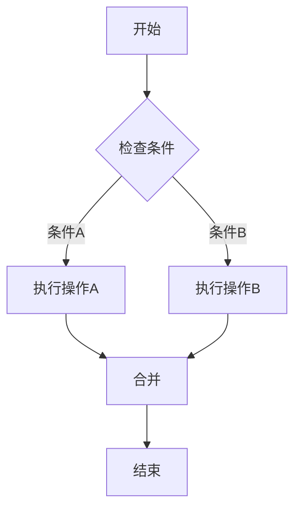
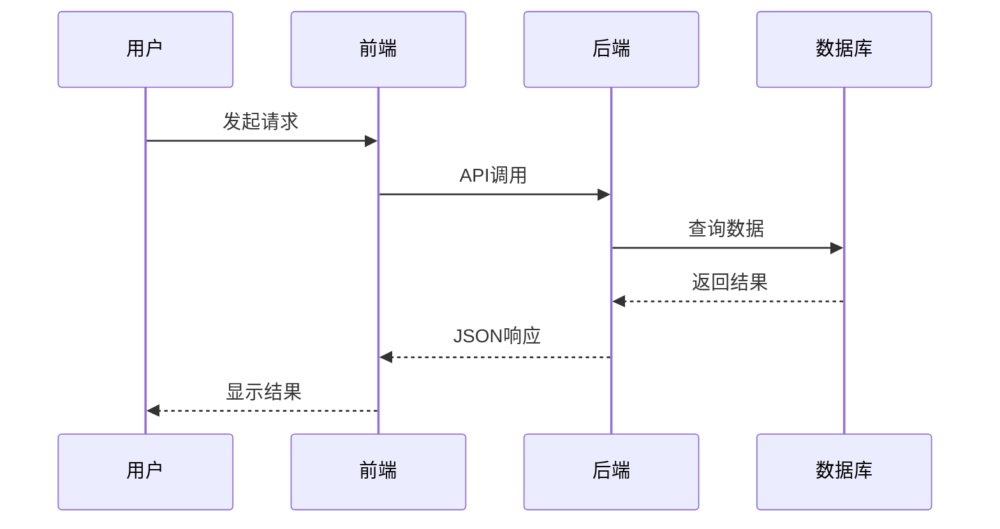
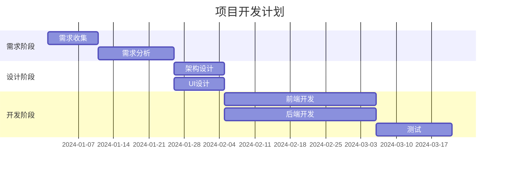
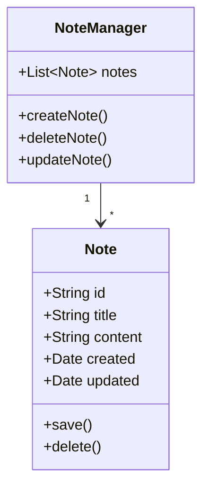

# Markdown 预览渲染测试文档

这是一个包含所有渲染功能的测试文档，可以直接复制到 Nota4 中测试预览效果。

---

## 1. 基础 Markdown 测试

### 1.1 标题测试

# 一级标题
## 二级标题
### 三级标题
#### 四级标题
##### 五级标题
###### 六级标题

### 1.2 文本样式

这是**粗体**文本。  
这是*斜体*文本。  
这是~~删除线~~文本。  
这是`行内代码`文本。

### 1.3 列表

无序列表：
- 苹果
- 香蕉
  - 香蕉1号
  - 香蕉2号
- 橙子

有序列表：
1. 第一步
2. 第二步
3. 第三步

### 1.4 引用

> 这是一段引用文本。
> 
> 可以有多段。

---

## 2. 代码高亮测试

### 2.1 Swift 代码

```swift
import Foundation

struct Note: Codable, Identifiable {
    let id: String
    var title: String
    var content: String
    var created: Date
    var updated: Date
    
    init(title: String = "", content: String = "") {
        self.id = UUID().uuidString
        self.title = title
        self.content = content
        self.created = Date()
        self.updated = Date()
    }
}

// 使用示例
let note = Note(title: "测试笔记", content: "Hello, World!")
print("笔记标题: \(note.title)")
```

### 2.2 JavaScript 代码

```javascript
// 斐波那契数列
function fibonacci(n) {
    if (n <= 1) return n;
    return fibonacci(n - 1) + fibonacci(n - 2);
}

// 快速排序
const quickSort = (arr) => {
    if (arr.length <= 1) return arr;
    const pivot = arr[Math.floor(arr.length / 2)];
    const left = arr.filter(x => x < pivot);
    const middle = arr.filter(x => x === pivot);
    const right = arr.filter(x => x > pivot);
    return [...quickSort(left), ...middle, ...quickSort(right)];
};

console.log(quickSort([3, 6, 8, 10, 1, 2, 1]));
```

### 2.3 Python 代码

```python
# 装饰器示例
def timer(func):
    import time
    def wrapper(*args, **kwargs):
        start = time.time()
        result = func(*args, **kwargs)
        end = time.time()
        print(f"{func.__name__} took {end - start:.4f} seconds")
        return result
    return wrapper

@timer
def slow_function():
    import time
    time.sleep(1)
    return "完成"

# 列表推导式
squares = [x**2 for x in range(10)]
print(squares)
```

---

## 3. Mermaid 图表测试

### 3.1 流程图



### 3.2 时序图



### 3.3 甘特图



### 3.4 类图



---

## 4. 数学公式测试

### 4.1 行内公式

爱因斯坦质能方程: $E = mc^2$

勾股定理: $a^2 + b^2 = c^2$

圆的面积: $A = \pi r^2$

### 4.2 块公式

高斯积分：

$$
\int_{-\infty}^{\infty} e^{-x^2} dx = \sqrt{\pi}
$$

导数定义：

$$
\frac{df}{dx} = \lim_{h \to 0} \frac{f(x+h) - f(x)}{h}
$$

泰勒级数展开：

$$
e^x = \sum_{n=0}^{\infty} \frac{x^n}{n!} = 1 + x + \frac{x^2}{2!} + \frac{x^3}{3!} + \cdots
$$

### 4.3 矩阵

$$
\begin{bmatrix}
1 & 2 & 3 \\
4 & 5 & 6 \\
7 & 8 & 9
\end{bmatrix}
\times
\begin{bmatrix}
a \\
b \\
c
\end{bmatrix}
=
\begin{bmatrix}
1a + 2b + 3c \\
4a + 5b + 6c \\
7a + 8b + 9c
\end{bmatrix}
$$

---

## 5. 表格测试

### 5.1 简单表格

| 姓名 | 年龄 | 职业 | 城市 |
|------|------|------|------|
| 张三 | 25   | 工程师 | 北京 |
| 李四 | 30   | 设计师 | 上海 |
| 王五 | 28   | 产品经理 | 深圳 |

### 5.2 对齐表格

| 左对齐 | 居中对齐 | 右对齐 |
|:-------|:--------:|-------:|
| 文本A  | 文本B    | 文本C  |
| 123    | 456      | 789    |

---

## 6. 链接和图片

### 6.1 链接

这是一个[外部链接](https://www.example.com)。

这是一个[GitHub链接](https://github.com)。

### 6.2 图片（占位）


---

## 7. 混合内容测试

### 7.1 引用中的代码

> 这是一段引用，包含代码：
> 
> ```python
> def hello():
>     print("Hello, World!")
> ```

### 7.2 列表中的公式

1. 第一个公式: $f(x) = x^2 + 2x + 1$
2. 第二个公式: $g(x) = \sin(x) + \cos(x)$
3. 第三个公式: $h(x) = e^{-x}$

### 7.3 表格中的代码

| 语言 | 示例代码 |
|------|----------|
| Python | `print("Hello")` |
| JavaScript | `console.log("Hello")` |
| Swift | `print("Hello")` |

---

## 8. 分隔线测试

上面的内容

---

中间的内容

***

下面的内容

___

最后的内容

---

## 9. 特殊字符测试

### HTML 实体

&copy; &reg; &trade;  
&lt; &gt; &amp;

### Emoji

😀 😃 😄 😁 😆 😅 🤣 😂  
👍 👎 👏 🙏 💪  
❤️ 💚 💙 💛 🧡  
⭐ ✨ 🎉 🎊

---

## 10. 性能测试

重复内容用于测试大文档性能：

Lorem ipsum dolor sit amet, consectetur adipiscing elit. Sed do eiusmod tempor incididunt ut labore et dolore magna aliqua. Ut enim ad minim veniam, quis nostrud exercitation ullamco laboris nisi ut aliquip ex ea commodo consequat.

Lorem ipsum dolor sit amet, consectetur adipiscing elit. Sed do eiusmod tempor incididunt ut labore et dolore magna aliqua. Ut enim ad minim veniam, quis nostrud exercitation ullamco laboris nisi ut aliquip ex ea commodo consequat.

Lorem ipsum dolor sit amet, consectetur adipiscing elit. Sed do eiusmod tempor incididunt ut labore et dolore magna aliqua. Ut enim ad minim veniam, quis nostrud exercitation ullamco laboris nisi ut aliquip ex ea commodo consequat.

---

## 总结

这个文档包含了所有需要测试的 Markdown 功能：

- ✅ 基础语法（标题、文本样式、列表、引用）
- ✅ 代码高亮（Swift、JavaScript、Python）
- ✅ Mermaid 图表（流程图、时序图、甘特图、类图）
- ✅ 数学公式（行内、块、矩阵）
- ✅ 表格
- ✅ 链接和图片
- ✅ 混合内容
- ✅ 特殊字符

**测试方法**：
1. 复制本文档内容到 Nota4
2. 切换到预览模式或分屏模式
3. 验证所有元素是否正确渲染
4. 测试主题切换
5. 检查性能和响应速度

