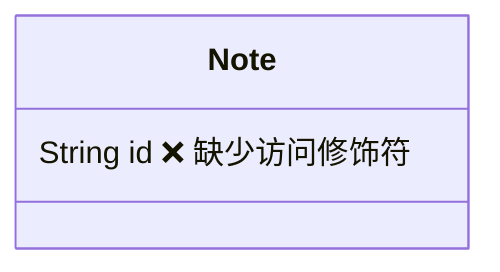
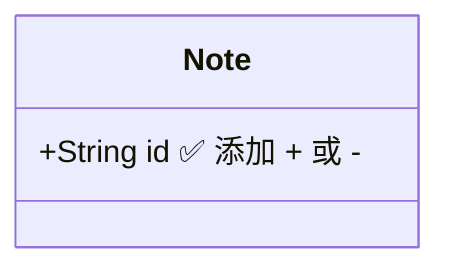
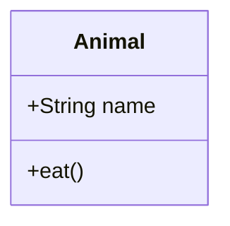
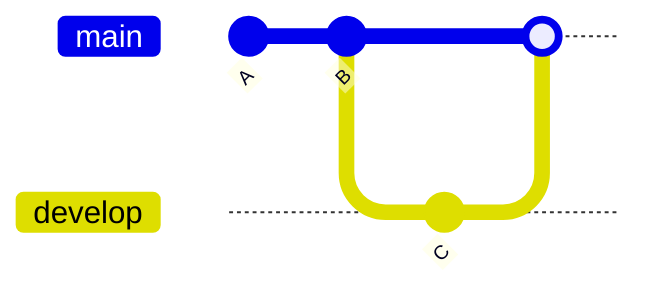
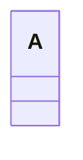
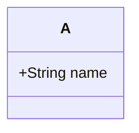

# Mermaid 图表调试指南

**创建日期**: 2025-11-16  
**目的**: 帮助诊断和修复 Mermaid 图表渲染问题

---

## 🎯 快速测试

### 步骤 1: 使用测试文档

1. **打开测试文档**:
   ```bash
   open Nota4/Docs/MERMAID_TEST.md
   ```

2. **在 Nota4 中创建新笔记**

3. **复制测试文档内容**到新笔记中

4. **切换到预览或分屏模式**

---

### 步骤 2: 查看渲染结果

测试文档包含 9 种 Mermaid 图表：

| 序号 | 图表类型 | 预期状态 |
|------|----------|----------|
| 1 | 流程图 (Flowchart) | ✅ 应该正常 |
| 2 | 时序图 (Sequence) | ✅ 应该正常 |
| 3.1-3.3 | 类图 (Class) | 🔍 **重点测试** |
| 4.1-4.3 | Git 图 (Git Graph) | 🔍 **重点测试** |
| 5 | 状态图 (State) | ✅ 应该正常 |
| 6 | 饼图 (Pie) | ✅ 应该正常 |
| 7 | 甘特图 (Gantt) | ✅ 应该正常 |
| 8 | ER 图 (ER Diagram) | ✅ 应该正常 |
| 9 | 用户旅程图 (Journey) | ✅ 应该正常 |

---

### 步骤 3: 查看调试日志

#### 在 macOS 上查看 WKWebView 控制台

**方法 1: Safari 开发者工具**

1. **启用 Safari 开发菜单**:
   - 打开 Safari
   - 菜单栏 → Safari → 设置 → 高级
   - 勾选 "在菜单栏中显示开发菜单"

2. **在 Nota4 中预览文档**

3. **Safari 菜单栏 → 开发 → 选择你的 Mac**

4. **找到 Nota4 的 WebView 进程**

5. **查看控制台输出**:
   ```
   🎨 [Mermaid] Starting rendering...
   🎨 [Mermaid] Found 9 diagrams
   🎨 [Mermaid] Rendering diagram 1
   📄 [Mermaid] Content: graph TD
       A[开始] --> B{判断}
   ✅ [Mermaid] Diagram 1 rendered successfully
   ...
   ```

**方法 2: 使用日志输出**

在 Swift 代码中添加日志（已实现）：
```swift
print("🎨 [RENDERER] Mermaid charts found: \(charts.count)")
```

---

## 🔍 诊断问题

### 问题 1: 没有找到图表

**控制台输出**:
```
⚠️ [Mermaid] No diagrams found
```

**可能原因**:
1. Mermaid 代码块未被正确提取
2. 占位符替换失败
3. HTML 结构问题

**解决方法**:
- 检查 Markdown 中的代码块格式
- 确保使用 ````mermaid` 标记
- 查看生成的 HTML 源代码

---

### 问题 2: 图表渲染失败

**控制台输出**:
```
❌ [Mermaid] Failed to render diagram 3 : SyntaxError: ...
```

**可能原因**:
1. Mermaid 语法错误
2. 不支持的图表类型或特性
3. Mermaid 版本不兼容

**解决方法**:
- 检查错误消息中的具体语法问题
- 参考 Mermaid 官方文档
- 尝试简化图表代码

---

### 问题 3: 特定图表类型不显示

#### Git 图不显示

**常见问题**:


**正确写法**:


#### 类图不显示

**常见问题**:


**正确写法**:


---

## 📊 调试日志详解

### 正常渲染的日志

```javascript
🎨 [Mermaid] Starting rendering...           // Mermaid 开始初始化
🎨 [Mermaid] Found 9 diagrams                // 找到 9 个图表
🎨 [Mermaid] Rendering diagram 1             // 渲染第 1 个图表
📄 [Mermaid] Content: graph TD...            // 图表内容预览
✅ [Mermaid] Diagram 1 rendered successfully // 渲染成功
...
🎨 [Mermaid] Rendering diagram 9
✅ [Mermaid] Diagram 9 rendered successfully
```

### 出错时的日志

```javascript
🎨 [Mermaid] Starting rendering...
🎨 [Mermaid] Found 3 diagrams
🎨 [Mermaid] Rendering diagram 1
✅ [Mermaid] Diagram 1 rendered successfully
🎨 [Mermaid] Rendering diagram 2
❌ [Mermaid] Failed to render diagram 2 : SyntaxError: Unexpected token 'tag'
// ⬆️ 这里显示具体错误
🎨 [Mermaid] Rendering diagram 3
✅ [Mermaid] Diagram 3 rendered successfully
```

### KaTeX 日志

```javascript
🔢 [KaTeX] Starting rendering...
✅ [KaTeX] Formula 1 rendered
✅ [KaTeX] Formula 2 rendered
...
```

---

## 🛠️ 改进说明

### v1 (之前)

**问题**:
- 使用 `startOnLoad: true`
- 批量渲染所有图表
- 没有错误日志
- 难以定位问题

**表现**:
- 某些图表静默失败
- 无法知道哪个图表出错
- 难以调试

### v2 (现在)

**改进**:
- 使用 `startOnLoad: false` + 手动控制
- 逐个渲染图表
- 详细的控制台日志
- 错误时显示友好提示

**表现**:
- 可以看到每个图表的渲染状态
- 错误信息清晰
- 便于调试和修复

---

## 📝 测试清单

### 基础测试

- [ ] 打开 `MERMAID_TEST.md`
- [ ] 在 Nota4 中预览
- [ ] 查看是否所有图表都显示

### 调试测试

- [ ] 打开 Safari 开发菜单
- [ ] 连接到 Nota4 的 WebView
- [ ] 查看控制台日志
- [ ] 确认找到正确数量的图表
- [ ] 检查是否有渲染错误

### 具体图表测试

**类图**:
- [ ] 3.1 最简单的类图
- [ ] 3.2 带关系的类图
- [ ] 3.3 复杂类图

**Git 图**:
- [ ] 4.1 最简单的 Git 图
- [ ] 4.2 带 ID 的 Git 图
- [ ] 4.3 多分支 Git 图

---

## 🔧 手动测试代码

### 最小化类图测试

```markdown
# 类图测试


```

### 最小化 Git 图测试

```markdown
# Git 图测试


```

---

## 🐛 已知问题和限制

### Git 图

1. **不支持 `tag` 语法**:
   ```mermaid
   merge develop tag: "v1.0"  ❌
   ```
   
   **解决方案**: 使用 commit 消息标注版本
   ```mermaid
   merge develop
   commit id: "Release v1.0"  ✅
   ```

2. **分支名称限制**:
   - 建议使用简单的英文名称
   - 避免使用特殊字符

### 类图

1. **访问修饰符必须显式**:
   ```mermaid
   String name  ❌
   +String name  ✅
   -String name  ✅
   ```

2. **关系语法严格**:
   ```mermaid
   A --> B : relation  ✅
   A "1" --> "*" B : relation  ✅
   ```

---

## 📚 参考资料

- [Mermaid 官方文档](https://mermaid.js.org/)
- [Mermaid Live Editor](https://mermaid.live/) - 在线测试
- [Class Diagram 文档](https://mermaid.js.org/syntax/classDiagram.html)
- [Git Graph 文档](https://mermaid.js.org/syntax/gitgraph.html)

---

## 💡 最佳实践

### 1. 从简单开始

先测试最简单的版本：


然后逐步添加复杂度：


### 2. 使用在线编辑器验证

在 [mermaid.live](https://mermaid.live/) 测试语法：
1. 粘贴你的代码
2. 查看是否渲染成功
3. 复制到 Nota4

### 3. 查看控制台

始终保持 Safari 开发者工具打开，实时查看日志。

### 4. 逐个测试

不要一次性添加所有图表，逐个添加并测试。

---

## ✅ 验收标准

### 最低要求

- [ ] 流程图正常渲染
- [ ] 时序图正常渲染
- [ ] 至少一个类图正常渲染
- [ ] 至少一个 Git 图正常渲染

### 完整要求

- [ ] 所有 9 种图表类型都能渲染
- [ ] 控制台有完整的日志输出
- [ ] 错误时显示友好提示
- [ ] 复杂图表也能正常显示

---

## 🆘 获取帮助

如果问题仍然存在：

1. **收集信息**:
   - 哪些图表无法显示
   - 完整的控制台日志
   - 具体的 Markdown 代码

2. **检查环境**:
   - macOS 版本
   - Nota4 版本
   - 网络连接（CDN 访问）

3. **简化测试**:
   - 使用 `MERMAID_TEST.md` 中的最简单示例
   - 排除语法问题

---

**调试愉快！** 🚀

如果按照这个指南操作后，Git 图和类图仍然无法显示，请提供控制台的完整日志输出，我会进一步协助。

