# Mermaid 图表渲染测试

此文档专门用于测试 Mermaid 各种图表的渲染效果。

---

## 1. 流程图（Flowchart）- 应该正常 ✅

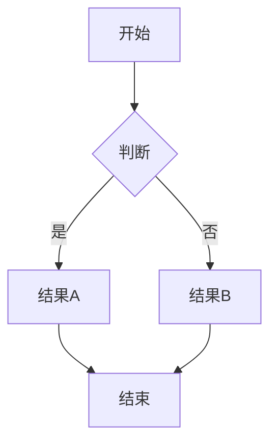

---

## 2. 时序图（Sequence Diagram）- 应该正常 ✅

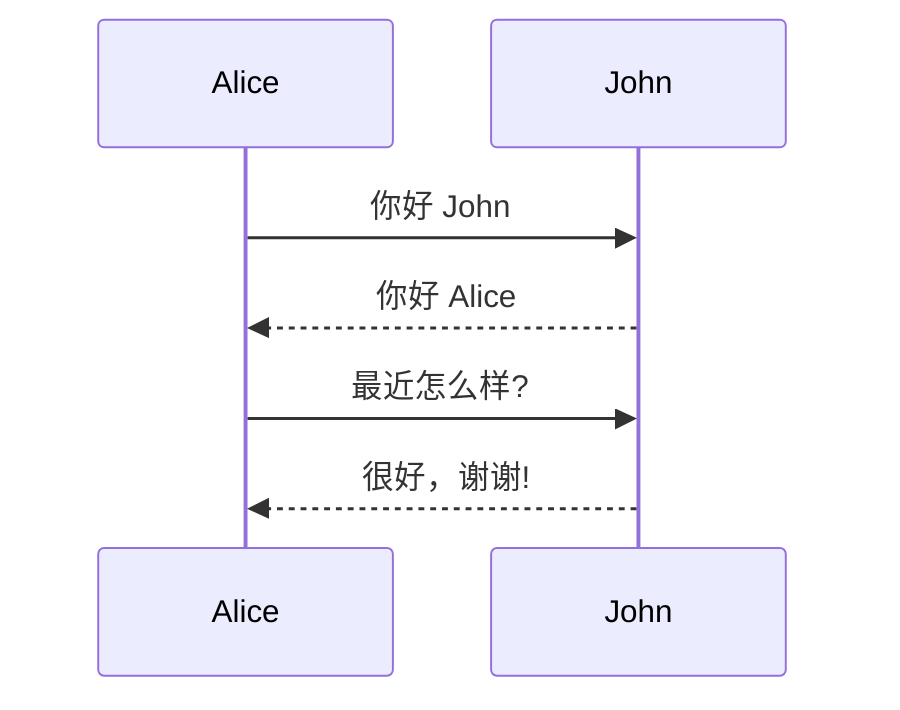

---

## 3. 类图（Class Diagram）- 测试重点 🔍

### 3.1 最简单的类图

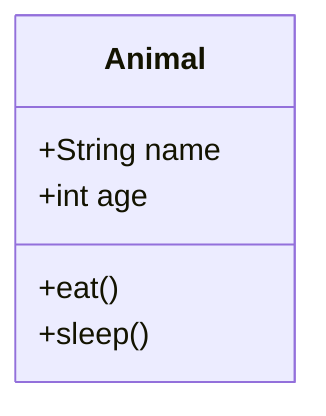

### 3.2 带关系的类图

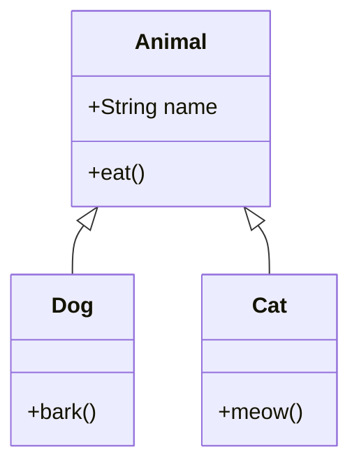

### 3.3 复杂类图

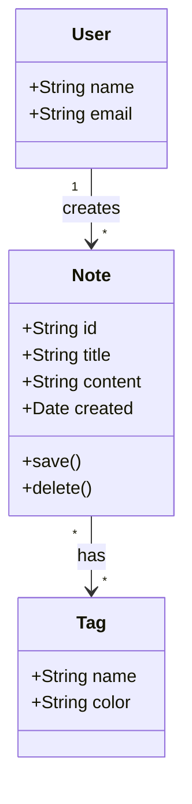

---

## 4. Git 图（Git Graph）- 测试重点 🔍

### 4.1 最简单的 Git 图

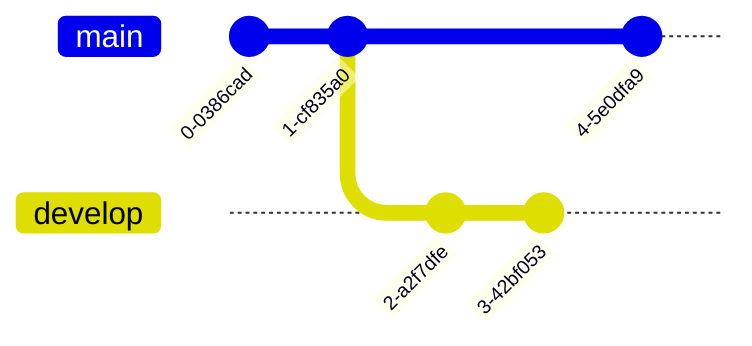

### 4.2 带 ID 的 Git 图

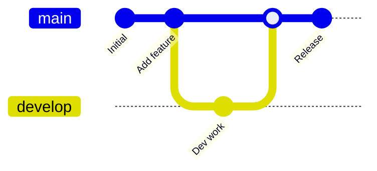

### 4.3 多分支 Git 图

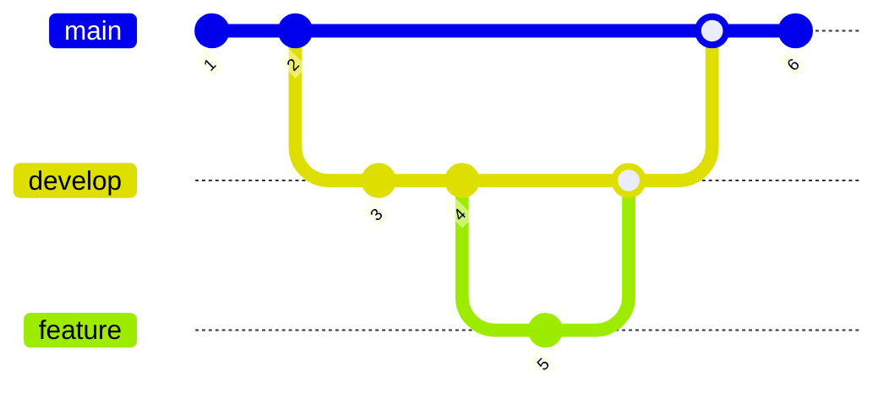

---

## 5. 状态图（State Diagram）- 应该正常 ✅

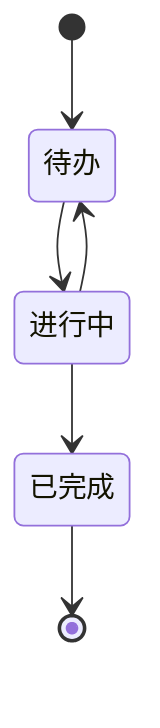

---

## 6. 饼图（Pie Chart）- 应该正常 ✅

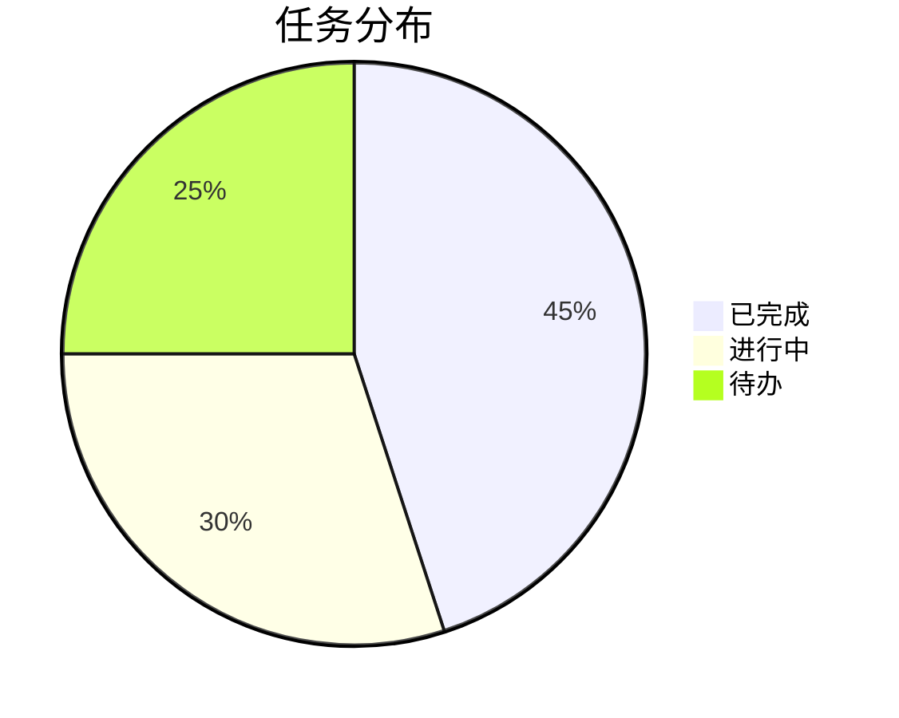

---

## 7. 甘特图（Gantt Chart）- 应该正常 ✅

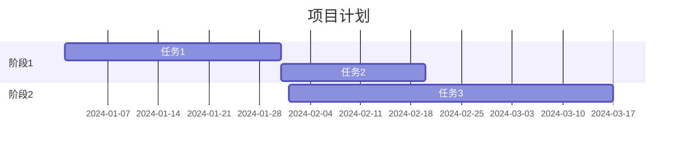

---

## 8. ER 图（Entity Relationship）- 应该正常 ✅

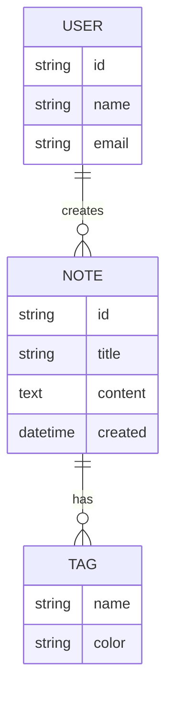

---

## 9. 用户旅程图（User Journey）- 应该正常 ✅

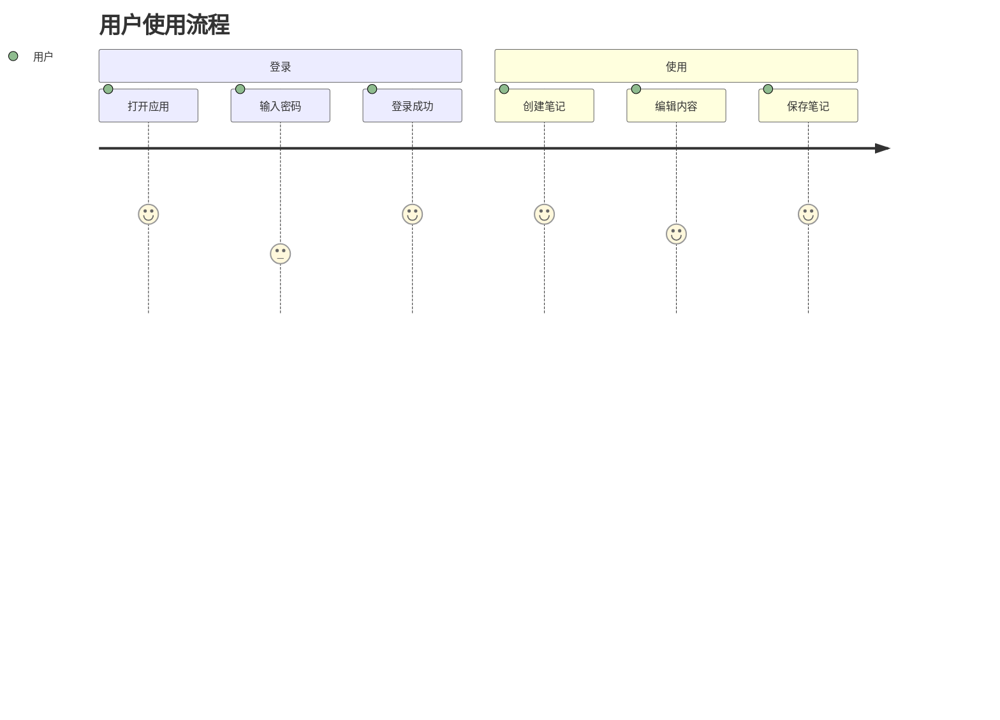

---

## 测试说明

### 预期结果

所有图表都应该正确渲染。如果某些图表不显示：

1. **检查控制台** - 打开浏览器开发者工具查看 JavaScript 错误
2. **检查网络** - 确保 Mermaid CDN 可以访问
3. **检查语法** - 某些图表可能有语法错误

### 重点测试

- **类图（第 3 节）**: 三个示例从简单到复杂
- **Git 图（第 4 节）**: 三个示例测试不同特性

### 如果仍然无法显示

请提供：
- 哪个图表无法显示
- 浏览器控制台的错误信息
- Nota4 版本信息

